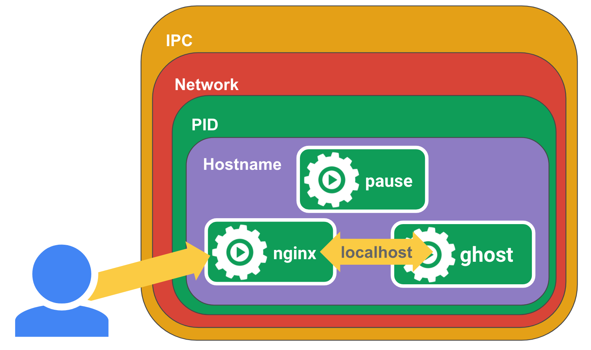

# 全能的 pause 容器

在查看 Kubernetes 集群节点时，你可能注意到在节点上运行 `docker ps` 时会看到一些名为 `pause` 的容器在运行。

```console
$ docker ps
CONTAINER ID        IMAGE                                       COMMAND ...
...
3b45e983c859        gcr.io/google_containers/pause-amd64:3.0    "/pause" ...
...
dbfc35b00062        gcr.io/google_containers/pause-amd64:3.0    "/pause" ...
...
c4e998ec4d5d        gcr.io/google_containers/pause-amd64:3.0    "/pause" ...
...
508102acf1e7        gcr.io/google_containers/pause-amd64:3.0    "/pause" ...
```

这些 “pause” 容器是什么？为什么会有这么多？发生了什么？

[](https://x.com/IanMLewis/status/913554746115424256)

要回答这些问题，我们需要后退一步，看看 Kubernetes 中 pod 的实现方式，特别是在 Docker/containerd 运行时下的实现。如果你还没读过，请先阅读我之前的文章：[什么是 Kubernetes Pod？](https://www.ianlewis.org/en/what-are-kubernetes-pods-anyway)。

Docker 支持容器，这对于部署单一软件单元非常好。但当你想把多个软件一起运行时，这种模型会变得有点麻烦。你经常会看到开发者创建的 Docker 镜像使用 supervisord 作为入口点来启动和管理多个进程。对于生产系统，许多人发现把这些应用作为一组部分隔离、部分共享环境的容器来部署更有用。

Kubernetes 为这种用例提供了一个干净的抽象——pod。它隐藏了 Docker 标志的复杂性以及需要照看容器、共享卷等的麻烦。它也屏蔽了不同容器运行时之间的差异。例如，[rkt 原生支持 pod](https://coreos.com/rkt/docs/latest/app-container.html#pods)，这样 Kubernetes 所需做的工作更少，但作为 Kubernetes 的使用者你并不需要去担心这些细节。

原则上，任何人都可以配置 Docker 来控制容器组之间的共享级别——你只需要创建一个父容器，知道用于创建与之共享同一环境的新容器的正确 flag 设置，然后管理这些容器的生命周期。管理这些组件的生命周期会变得相当复杂。

在 Kubernetes 中，pause 容器充当 pod 中所有容器的 “父容器”。pause 容器有两个核心职责。第一，它作为 pod 中 Linux 命名空间共享的基础。第二，当启用 PID（进程 ID）命名空间共享时，它会作为每个 pod 的 PID 1 并回收僵尸进程。

## 共享命名空间

在 Linux 中，当你运行一个新进程时，该进程会从父进程继承它的命名空间。让进程在新命名空间中运行的方式是通过与父进程“取消共享”（unshare）命名空间，从而创建一个新的命名空间。下面是使用 `unshare` 工具在新的 PID、UTS、IPC 和 mount 命名空间中运行一个 shell 的示例：

```bash
sudo unshare --pid --uts --ipc --mount -f chroot rootfs /bin/sh
```

进程一旦运行，就可以把其他进程添加到该进程的命名空间中以形成一个 pod。可以使用 `setns` 系统调用把新进程加入到现有命名空间中。

pod 中的容器之间会共享命名空间。Docker 允许你自动化这一过程，我们来看一个使用 pause 容器并共享命名空间从头创建 pod 的示例。首先需要用 Docker 启动 pause 容器，以便我们可以把容器添加到这个 pod。

```bash
docker run -d --name pause -p 8080:80 gcr.io/google_containers/pause-amd64:3.0
```

然后我们可以运行 pod 的容器。首先运行 nginx。这里会把 nginx 配置为将请求代理到其本地的 2368 端口。

> 注意我们把宿主机的 8080 端口映射到了 pause 容器的 80 端口，而不是映射到 nginx 容器，因为 pause 容器设置了 nginx 将要加入的初始网络命名空间。

```console
$ cat <<EOF >> nginx.conf
> error_log stderr;
> events { worker_connections  1024; }
> http {
>     access_log /dev/stdout combined;
>     server {
>         listen 80 default_server;
>         server_name example.com www.example.com;
>         location / {
>             proxy_pass http://127.0.0.1:2368;
>         }
>     }
> }
> EOF
$ docker run -d --name nginx -v `pwd`/nginx.conf:/etc/nginx/nginx.conf --net=container:pause --ipc=container:pause --pid=container:pause nginx
```

然后我们再创建另一个用于 [Ghost](https://github.com/TryGhost/Ghost) 博客应用的容器，作为我们的应用服务器。

```bash
docker run -d --name ghost --net=container:pause --ipc=container:pause --pid=container:pause ghost
```

在这两种情况下，我们都指定了 pause 容器作为要加入其命名空间的容器。这样就等同于创建了一个 pod。如果你访问 `http://localhost:8080/`，应该能看到通过 nginx 代理运行的 ghost，因为网络命名空间在 pause、nginx 和 ghost 容器之间是共享的。



如果你觉得这一切很复杂，那确实是——而且我们还没涉及如何监控和管理这些容器的生命周期。Kubernetes 的好处就是通过 pod，Kubernetes 为你管理了这一切。

## 回收僵尸进程

在 Linux 中，PID 命名空间里的进程形成一棵树，每个进程都有一个父进程。只有树根处的一个进程实际上没有父进程。这个进程就是 “init” 进程（PID 1）。

进程可以通过 `fork` 和 `exec` 系统调用来启动其他进程。新进程的父进程是调用 `fork` 的那个进程。`fork` 用于启动当前进程的另一个副本，`exec` 用于用一个新程序替换当前进程（为了运行一个完全不同的应用，你需要先 `fork` 然后在子进程中 `exec`）。大多数语言会通过一个函数把这两个步骤封装起来。每个进程在操作系统的进程表中都有一项条目，记录了进程的状态和退出码。当子进程结束运行时，其进程表条目会一直存在，直到父进程通过 `wait` 系统调用取回其退出码——这个过程称为“回收（reaping）”僵尸进程。


> [CC0 署名](https://creativecommons.org/publicdomain/zero/1.0/deed.en) [https://pixabay.com/en/zombie-warning-road-sign-roadsign-147945/](https://pixabay.com/en/zombie-warning-road-sign-roadsign-147945/)

僵尸进程是指已经停止运行但其进程表条目仍然存在，因为父进程尚未通过 `wait` 取得其退出码。技术上每个终止的进程都会短暂成为僵尸，但它们可能会存在更长时间。

较长时间存在的僵尸进程通常发生在父进程没有在子进程结束后调用 `wait`，一种情况是父进程实现不当直接漏掉了 `wait` 调用，另一种情况是父进程在子进程之前死亡，而新的父进程没有对其调用 `wait`。当一个进程的父进程比子进程先退出时，操作系统会把该子进程的父进程指向 “init” 进程（即 PID 1）。换言之，init 进程会“收养”该子进程，成为它的新父进程。这样一来，当子进程退出时，新的父进程（init）就必须调用 `wait` 来获取退出码，否则该进程表条目会永远存在，成为僵尸。

在容器中，每个 PID 命名空间必须有一个 init 进程。对于 Docker 来说，每个容器通常都有自己的 PID 命名空间，ENTRYPOINT 进程就是 init 进程。然而，正如我在之前关于 Kubernetes pod 的文章中提到的，一个容器可以被配置为运行在另一个容器的命名空间中。在这种情况下，必须有一个容器来承担 init 进程的角色，而其他容器则作为该命名空间下的子进程被添加进来。

在关于 Kubernetes pod 的文章里，我是在一个容器中运行 nginx，然后把 ghost 添加到 nginx 的 PID 命名空间中的：

```bash
docker run -d --name nginx -v `pwd`/nginx.conf:/etc/nginx/nginx.conf -p 8080:80 nginx
docker run -d --name ghost --net=container:nginx --ipc=container:nginx --pid=container:nginx ghost
```

在这种情况下，nginx 承担了 PID 1 的角色，ghost 被作为 nginx 的子进程添加进来。这在大多数情况下是可以的，但技术上讲 nginx 现在要负责 ghost 孤立（orphaned）后留下的任何子进程。如果例如 ghost fork 出了子进程或使用 `exec` 运行了子进程，而在子进程结束之前 ghost 崩溃，那么那些子进程会被收养到 nginx。然而，nginx 并不是为作为 init 进程去回收僵尸而设计的。这意味着我们可能会产生大量僵尸进程，并且它们会一直存在于该容器的生命周期中。

在 Kubernetes pod 中，容器的运行方式与上面类似，但每个 pod 都会为其创建一个特殊的 pause 容器。这个 pause 容器运行一个非常简单的进程，基本上就是“永远睡眠”（参见下面的 `pause()` 调用）。它非常简单，以至于我可以在此处包含截至本文撰写时的完整源码：

```c
/*
Copyright 2016 The Kubernetes Authors.
Licensed under the Apache License, Version 2.0 (the "License");
you may not use this file except in compliance with the License.
You may obtain a copy of the License at
    http://www.apache.org/licenses/LICENSE-2.0
Unless required by applicable law or agreed to in writing, software
distributed under the License is distributed on an "AS IS" BASIS,
WITHOUT WARRANTIES OR CONDITIONS OF ANY KIND, either express or implied.
See the License for the specific language governing permissions and
limitations under the License.
*/

#include <signal.h>
#include <stdio.h>
#include <stdlib.h>
#include <sys/types.h>
#include <sys/wait.h>
#include <unistd.h>

static void sigdown(int signo) {
  psignal(signo, "Shutting down, got signal");
  exit(0);
}

static void sigreap(int signo) {
  while (waitpid(-1, NULL, WNOHANG) > 0);
}

int main() {
  if (getpid() != 1)
    /* Not an error because pause sees use outside of infra containers. */
    fprintf(stderr, "Warning: pause should be the first process\n");

  if (sigaction(SIGINT, &(struct sigaction){.sa_handler = sigdown}, NULL) < 0)
    return 1;
  if (sigaction(SIGTERM, &(struct sigaction){.sa_handler = sigdown}, NULL) < 0)
    return 2;
  if (sigaction(SIGCHLD, &(struct sigaction){.sa_handler = sigreap,
                                             .sa_flags = SA_NOCLDSTOP},
                NULL) < 0)
    return 3;

  for (;;)
    pause();
  fprintf(stderr, "Error: infinite loop terminated\n");
  return 42;
}
```

如你所见，它并不仅仅是睡眠。它还执行另一个重要功能：它承担 PID 1 的角色，并在子进程被其父进程遗弃时通过调用 `wait` 来回收任何僵尸进程（参见 `sigreap`）。通过这种方式，我们不会让僵尸进程在 Kubernetes pod 的 PID 命名空间中堆积。

## 关于 PID 命名空间共享的一些背景

值得注意的是，关于 PID 命名空间共享存在许多反复讨论。只有在启用了 PID 命名空间共享的情况下，pause 容器才会回收僵尸进程，并且当前这项功能仅在 Kubernetes 1.7+ 中可用。如果在运行 Kubernetes 1.7 且使用 Docker 1.13.1+ 时，它会默认启用，除非通过 kubelet 的一个 [flag](https://kubernetes.io/docs/admin/kubelet/) (`--docker-disable-shared-pid=true`) 将其禁用。该行为在 Kubernetes 1.8 中被 [回退](https://github.com/kubernetes/kubernetes/pull/51634)，现在默认是禁用的，除非通过 kubelet flag (`--docker-disable-shared-pid=false`) 显式启用。关于为 PID 命名空间共享添加支持的讨论可见于 [这个 GitHub issue](https://github.com/kubernetes/kubernetes/issues/1615)。

如果没有启用 PID 命名空间共享，那么 Kubernetes pod 中的每个容器将拥有自己的 PID 1，并且每个容器都需要自行回收僵尸进程。很多情况下这并不是问题，因为应用并不产生子进程，但僵尸进程占用内存是一个经常被忽视的问题。基于这个原因，以及 PID 命名空间共享允许在同一 pod 中向容器发送信号的便利，我非常希望 PID 命名空间共享能成为 Kubernetes 的默认行为。

## 加入我们的社区

希望这篇文章有助于阐明 Kubernetes 的一个核心部分。如果你觉得这篇文章有帮助，请在评论区或 Twitter 上告诉我。如果你对 Kubernetes 感兴趣并想加入我们的社区，可以通过以下方式参与：

- 在 [Stack Overflow](https://stackoverflow.com/questions/tagged/kubernetes) 上发布和回答问题
- 关注 Twitter 上的 [@Kubernetesio](https://x.com/kubernetesio)（顺便也关注我吧！）。
- 加入 Kubernetes 的 [Slack](http://slack.k8s.io/) 并来聊聊。（我在那里的用户名是 ianlewis，来打个招呼！）
- 在 [GitHub](https://github.com/kubernetes/kubernetes) 上为 Kubernetes 项目做贡献

希望很快见到你！

> 我想感谢 [Eric Tune](https://x.com/erictune4)、[Ahmet Alp Balkan](https://x.com/ahmetb)、[Craig Box](https://x.com/craigbox)、[Mete Atamel](https://x.com/meteatamel)、[Nikhil Jindal](https://x.com/nikhiljindal181) 和 Jack Wilber 对本文的审阅。
