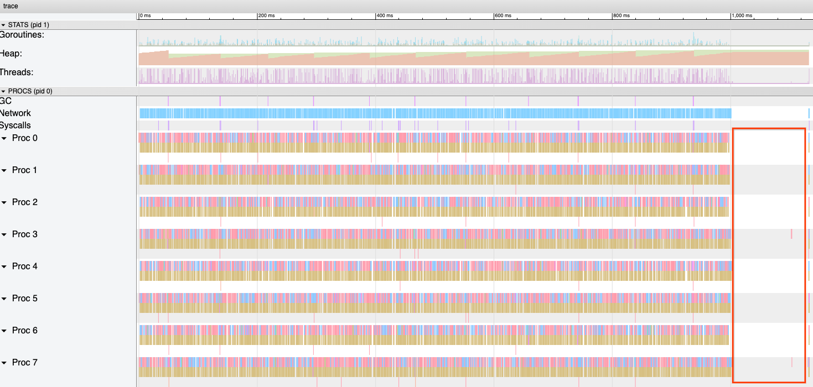
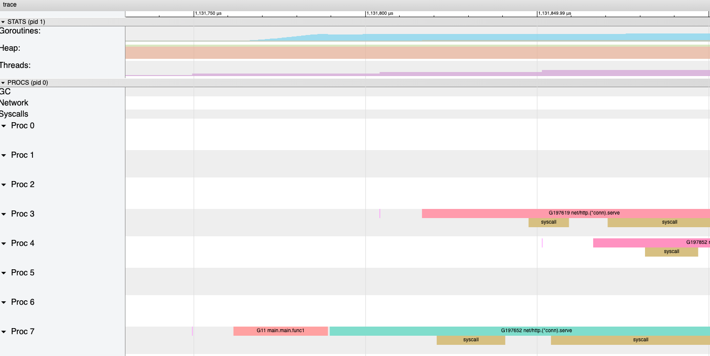
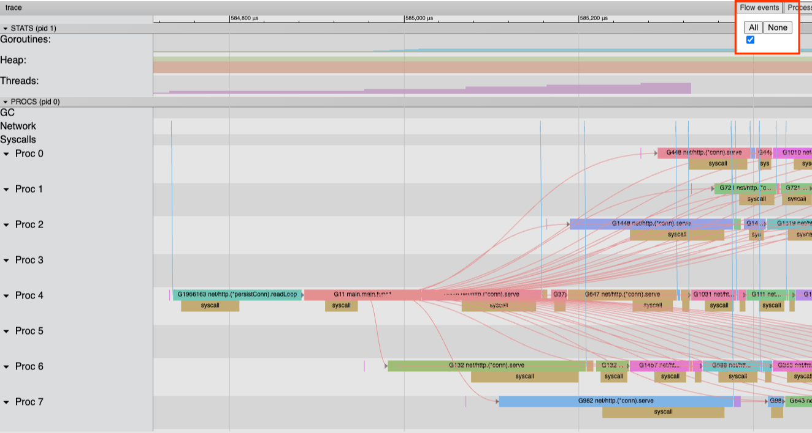
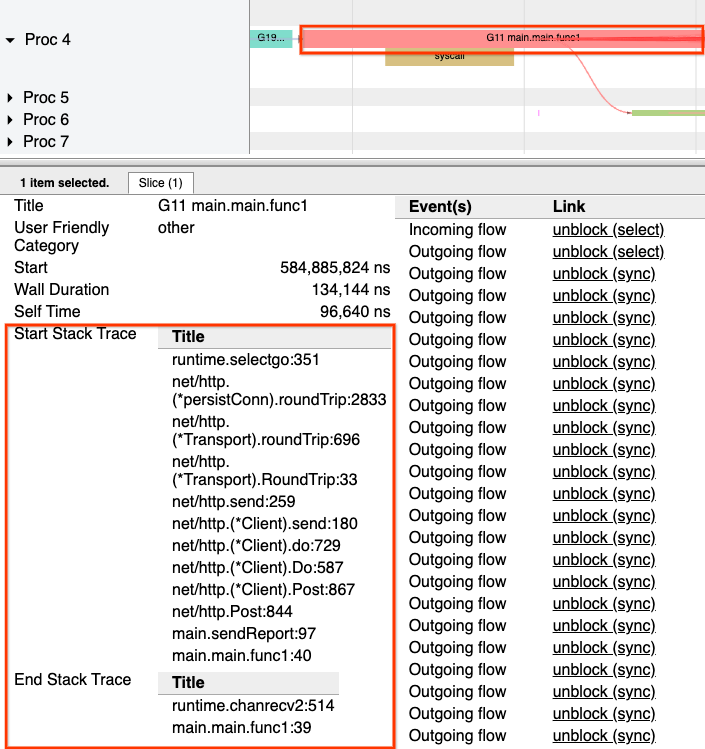
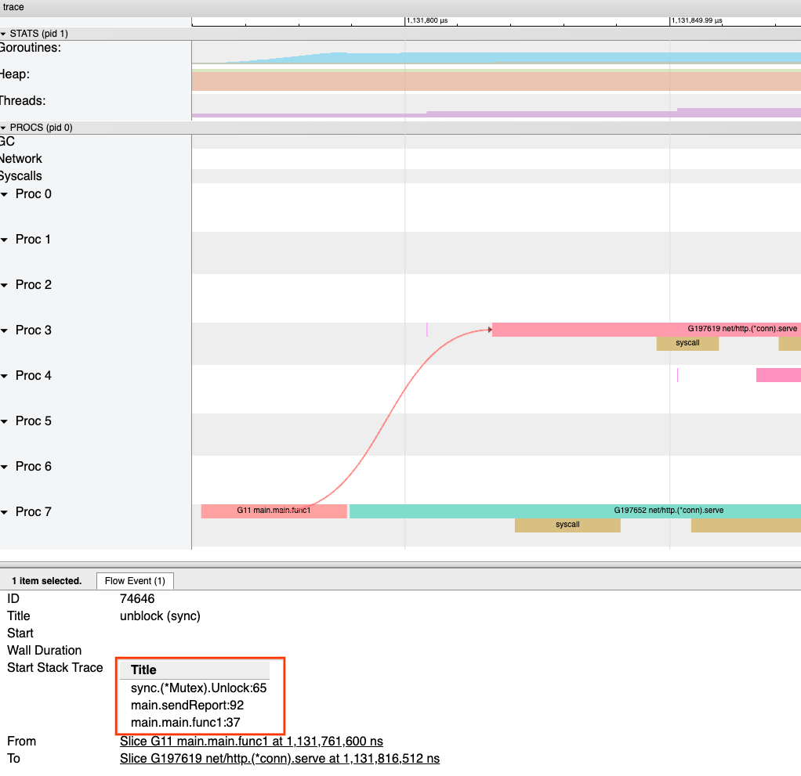

# Go 1.25 中的飞行记录器

Carlos Amedee 和 Michael Knyszek

2025年9月26日

<details open>

<summary>Additional languages</summary>

- [English](README.md)

</details>

在2024年，我们向世界介绍了[更强大的 Go 执行跟踪](https://go.dev/blog/execution-traces-2024)。在那篇博客文章中，我们预览了新的执行跟踪器可以解锁的一些新功能，包括*飞行记录*。我们很高兴地宣布，飞行记录现在已在 Go 1.25 中可用，它是 Go 诊断工具箱中的一个强大新工具。

## 执行跟踪

首先，快速回顾一下 Go 执行跟踪。

Go 运行时可以记录 Go 应用程序执行期间发生的许多事件的日志。该日志称为运行时执行跟踪。Go 执行跟踪包含大量关于 goroutine 如何相互交互以及如何与底层系统交互的信息。这使得它们对于调试延迟问题非常方便，因为它们不仅告诉您 goroutine 何时执行，更重要的是，告诉您它们何时不执行。

[runtime/trace](https://pkg.go.dev/runtime/trace) 包提供了一个 API，通过调用 `runtime/trace.Start` 和 `runtime/trace.Stop` 来收集给定时间窗口内的执行跟踪。如果您要跟踪的代码只是一个测试、微基准测试或命令行工具，这很有效。您可以收集完整端到端执行的跟踪，或者只收集您关心的部分。

然而，在长期运行的 Web 服务中（这是 Go 众所周知的应用程序类型），这还不够好。Web 服务器可能会运行数天甚至数周，收集整个执行的跟踪会产生太多需要筛选的数据。通常只是程序执行的一个部分出错，比如请求超时或健康检查失败。当它发生时，调用 `Start` 已经太晚了！

解决这个问题的一种方法是从整个集群中随机采样执行跟踪。虽然这种方法很强大，并且可以在问题成为故障之前帮助发现问题，但它需要大量基础设施才能运行。需要存储、分类和处理大量的执行跟踪数据，其中许多数据根本不包含任何有趣的内容。当您试图找出特定问题的根本原因时，这根本行不通。

## 飞行记录

这就引出了飞行记录器。

程序通常知道何时出了问题，但根本原因可能发生在很久以前。飞行记录器允许您收集程序检测到问题之前最后几秒钟执行的跟踪。

飞行记录器像往常一样收集执行跟踪，但不是将其写入套接字或文件，而是将最后几秒钟的跟踪缓冲在内存中。在任何时候，程序都可以请求缓冲区的内容，并精确地快照问题时间窗口。飞行记录器就像一把手术刀，直接切入问题区域。

## 示例

让我们通过一个示例来学习如何使用飞行记录器。具体来说，让我们用它来诊断一个实现"猜数字"游戏的 HTTP 服务器的性能问题。它暴露了一个 `/guess-number` 端点，接受一个整数，并告知调用者他们是否猜对了数字。还有一个 goroutine，每分钟一次，通过 HTTP 请求将所有猜测的数字报告发送到另一个服务。

```go
// bucket 是一个简单的互斥锁保护的计数器。
type bucket struct {
    mu      sync.Mutex
    guesses int
}

func main() {
    // 为每个客户端可能猜测的有效数字创建一个桶。
    // HTTP 处理程序将通过使用数字作为切片索引来在 buckets 中查找猜测的数字。
    buckets := make([]bucket, 100)

    // 每分钟，我们发送每个数字被猜测次数的报告。
    go func() {
        for range time.Tick(1 * time.Minute) {
            sendReport(buckets)
        }
    }()

    // 选择要猜测的数字。
    answer := rand.Intn(len(buckets))

    http.HandleFunc("/guess-number", func(w http.ResponseWriter, r *http.Request) {
        start := time.Now()

        // 从 URL 查询变量 "guess" 中获取数字并将其转换为整数。然后验证它。
        guess, err := strconv.Atoi(r.URL.Query().Get("guess"))
        if err != nil || !(0 <= guess && guess < len(buckets)) {
            http.Error(w, "invalid 'guess' value", http.StatusBadRequest)
            return
        }

        // 选择适当的桶并安全地递增其值。
        b := &buckets[guess]
        b.mu.Lock()
        b.guesses++
        b.mu.Unlock()

        // 向客户端响应猜测结果以及是否正确。
        fmt.Fprintf(w, "guess: %d, correct: %t", guess, guess == answer)

        log.Printf("HTTP request: endpoint=/guess-number guess=%d duration=%s", guess, time.Since(start))
    })
    log.Fatal(http.ListenAndServe(":8090", nil))
}

// sendReport 将 buckets 的当前状态发布到远程服务。
func sendReport(buckets []bucket) {
    counts := make([]int, len(buckets))

    for index := range buckets {
        b := &buckets[index]
        b.mu.Lock()
        defer b.mu.Unlock()

        counts[index] = b.guesses
    }

    // 将报告数据编组为 JSON 负载。
    b, err := json.Marshal(counts)
    if err != nil {
        log.Printf("failed to marshal report data: error=%s", err)
        return
    }
    url := "http://localhost:8091/guess-number-report"
    if _, err := http.Post(url, "application/json", bytes.NewReader(b)); err != nil {
        log.Printf("failed to send report: %s", err)
    }
}
```

这是服务器的完整代码：[https://go.dev/play/p/rX1eyKtVglF](https://go.dev/play/p/rX1eyKtVglF)，以及一个简单客户端的代码：[https://go.dev/play/p/2PjQ-1ORPiw](https://go.dev/play/p/2PjQ-1ORPiw)。为了避免第三个进程，"客户端"也实现了报告服务器，尽管在真实系统中这将是分开的。

假设在将应用程序部署到生产环境后，我们收到了用户投诉，说某些 `/guess-number` 调用花费的时间比预期长。当我们查看日志时，我们看到有时响应时间超过 100 毫秒，而大多数调用都在微秒级别。

```
2025/09/19 16:52:02 HTTP request: endpoint=/guess-number guess=69 duration=625ns
2025/09/19 16:52:02 HTTP request: endpoint=/guess-number guess=62 duration=458ns
2025/09/19 16:52:02 HTTP request: endpoint=/guess-number guess=42 duration=1.417µs
2025/09/19 16:52:02 HTTP request: endpoint=/guess-number guess=86 duration=115.186167ms
2025/09/19 16:52:02 HTTP request: endpoint=/guess-number guess=0 duration=127.993375ms
```

在我们继续之前，花一分钟看看您是否能发现问题！

无论您是否找到了问题，让我们深入探讨，看看如何从第一原理找到问题。特别是，如果我们能看到应用程序在慢响应之前的时间内在做什么，那就太好了。这正是飞行记录器的用途！我们将在看到第一个响应超过 100 毫秒时使用它来捕获执行跟踪。

首先，在 `main` 中，我们将配置并启动飞行记录器：

```go
// 设置飞行记录器
fr := trace.NewFlightRecorder(trace.FlightRecorderConfig{
    MinAge:   200 * time.Millisecond,
    MaxBytes: 1 << 20, // 1 MiB
})
fr.Start()
```

`MinAge` 配置可靠保留跟踪数据的持续时间，我们建议将其设置为事件时间窗口的约 2 倍。例如，如果您正在调试 5 秒超时，请将其设置为 10 秒。`MaxBytes` 配置缓冲跟踪的大小，这样您就不会炸毁内存使用量。平均而言，您可以预期每秒执行会产生几 MB 的跟踪数据，或者对于繁忙的服务为 10 MB/s。

接下来，我们将添加一个辅助函数来捕获快照并将其写入文件：

```go
var once sync.Once

// captureSnapshot 捕获飞行记录器快照。
func captureSnapshot(fr *trace.FlightRecorder) {
    // once.Do 确保提供的函数只执行一次。
    once.Do(func() {
        f, err := os.Create("snapshot.trace")
        if err != nil {
            log.Printf("opening snapshot file %s failed: %s", f.Name(), err)
            return
        }
        defer f.Close() // 忽略错误

        // WriteTo 将飞行记录器数据写入提供的 io.Writer。
        _, err = fr.WriteTo(f)
        if err != nil {
            log.Printf("writing snapshot to file %s failed: %s", f.Name(), err)
            return
        }

        // 在快照被捕获后停止飞行记录器。
        fr.Stop()
        log.Printf("captured a flight recorder snapshot to %s", f.Name())
    })
}
```

最后，就在记录完成的请求之前，如果请求花费了超过 100 毫秒，我们将触发快照：

```go
// 如果响应花费超过 100ms，捕获快照。
// 只有第一次调用有效果。
if fr.Enabled() && time.Since(start) > 100*time.Millisecond {
    go captureSnapshot(fr)
}
```

这是现在使用飞行记录器进行检测的服务器的完整代码：[https://go.dev/play/p/3V33gfIpmjG](https://go.dev/play/p/3V33gfIpmjG)

现在，我们再次运行服务器并发送请求，直到我们得到一个触发快照的慢请求。

一旦我们获得了跟踪，我们需要一个工具来帮助我们检查它。Go 工具链通过 [`go tool trace` 命令](https://pkg.go.dev/cmd/trace) 提供了一个内置的执行跟踪分析工具。运行 `go tool trace snapshot.trace` 启动该工具，它会启动一个本地 Web 服务器，然后在浏览器中打开显示的 URL（如果该工具没有自动打开您的浏览器）。

这个工具为我们提供了几种查看跟踪的方法，但让我们专注于可视化跟踪以了解发生了什么。点击 "View trace by proc" 来这样做。

在这个视图中，跟踪以事件时间线的形式呈现。在页面顶部的 "STATS" 部分，我们可以看到应用程序状态的摘要，包括线程数、堆大小和 goroutine 计数。

在下面的 "PROCS" 部分，我们可以看到 goroutine 的执行如何映射到 `GOMAXPROCS`（Go 应用程序创建的操作系统线程数）。我们可以看到每个 goroutine 何时以及如何开始、运行，最后停止执行。

现在，让我们将注意力转向查看器右侧的这个巨大的执行间隙。在一段时间内，大约 100 毫秒，什么都没有发生！



通过选择 `zoom` 工具（或按 `3`），我们可以更详细地检查间隙之后的部分跟踪。



除了每个单独 goroutine 的活动之外，我们还可以看到 goroutine 如何通过"流事件"进行交互。传入流事件指示是什么使 goroutine 开始运行。传出流边指示一个 goroutine 对另一个 goroutine 产生了什么影响。启用所有流事件的可视化通常提供暗示问题来源的线索。



在这种情况下，我们可以看到许多 goroutine 在活动暂停之后直接连接到单个 goroutine。

点击单个 goroutine 显示一个充满传出流事件的事件表，这与我们在启用流视图时看到的情况相匹配。

当这个 goroutine 运行时发生了什么？存储在跟踪中的部分信息是不同时间点的堆栈跟踪视图。当我们查看这个 goroutine 时，我们可以看到起始堆栈跟踪显示当 goroutine 被调度运行时，它正在等待 HTTP 请求完成。而结束堆栈跟踪显示 `sendReport` 函数已经返回，并且它正在等待计时器发送下一个预定时间的报告。



在这个 goroutine 运行的开始和结束之间，我们看到大量的"传出流"，它与其他 goroutine 交互。点击其中一个 `Outgoing flow` 条目将带我们到交互视图。



这个流涉及 `sendReport` 中的 `Unlock`：

```go
for index, b := range buckets {
    b.mu.Lock()
    defer b.mu.Unlock()

    counts[index] = b.value
}
```

在 `sendReport` 中，我们打算获取每个桶的锁，并在复制值后释放锁。

但问题是：我们实际上并没有在复制 `bucket.guesses` 中包含的值后立即释放锁。因为我们使用了 `defer` 语句来释放锁，所以该释放直到函数返回时才会发生。我们不仅在循环结束后持有锁，而且在 HTTP 请求完成后仍然持有锁。这是一个微妙的错误，在大型生产系统中可能难以追踪。

幸运的是，执行跟踪帮助我们精确定位了问题。然而，如果我们尝试在没有新的飞行记录模式的情况下在长期运行的服务器中使用执行跟踪器，它可能会积累大量的执行跟踪数据，操作员必须存储、传输和筛选这些数据。飞行记录器给了我们后见之明的力量。它让我们在问题发生后捕获问题所在，并快速锁定原因。

飞行记录器只是 Go 开发者工具箱中用于诊断运行中应用程序内部工作的最新补充。在过去的几个版本中，我们一直在稳步改进跟踪。Go 1.21 大大降低了跟踪的运行时开销。跟踪格式在 Go 1.22 版本中变得更加健壮和可拆分，从而实现了像飞行记录器这样的功能。像 [gotraceui](https://gotraceui.dev/) 这样的开源工具，以及[即将推出的以编程方式解析执行跟踪的能力](https://go.dev/issue/62627) 是利用执行跟踪力量的更多方式。[诊断页面](https://go.dev/doc/diagnostics) 列出了许多您可以使用的其他工具。我们希望您在编写和完善 Go 应用程序时使用它们。

## 致谢

我们想花点时间感谢那些在诊断会议中活跃、为设计做出贡献并在多年来提供反馈的社区成员：Felix Geisendörfer ([@felixge.de](https://bsky.app/profile/felixge.de))、Nick Ripley ([@nsrip-dd](https://github.com/nsrip-dd))、Rhys Hiltner ([@rhysh](https://github.com/rhysh))、Dominik Honnef ([@dominikh](https://github.com/dominikh))、Bryan Boreham ([@bboreham](https://github.com/bboreham)) 和 PJ Malloy ([@thepudds](https://github.com/thepudds))。

你们所有的讨论、反馈和工作在推动我们走向更好的诊断未来方面发挥了重要作用。谢谢你们！
