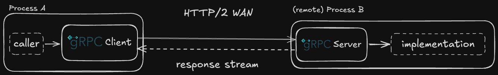
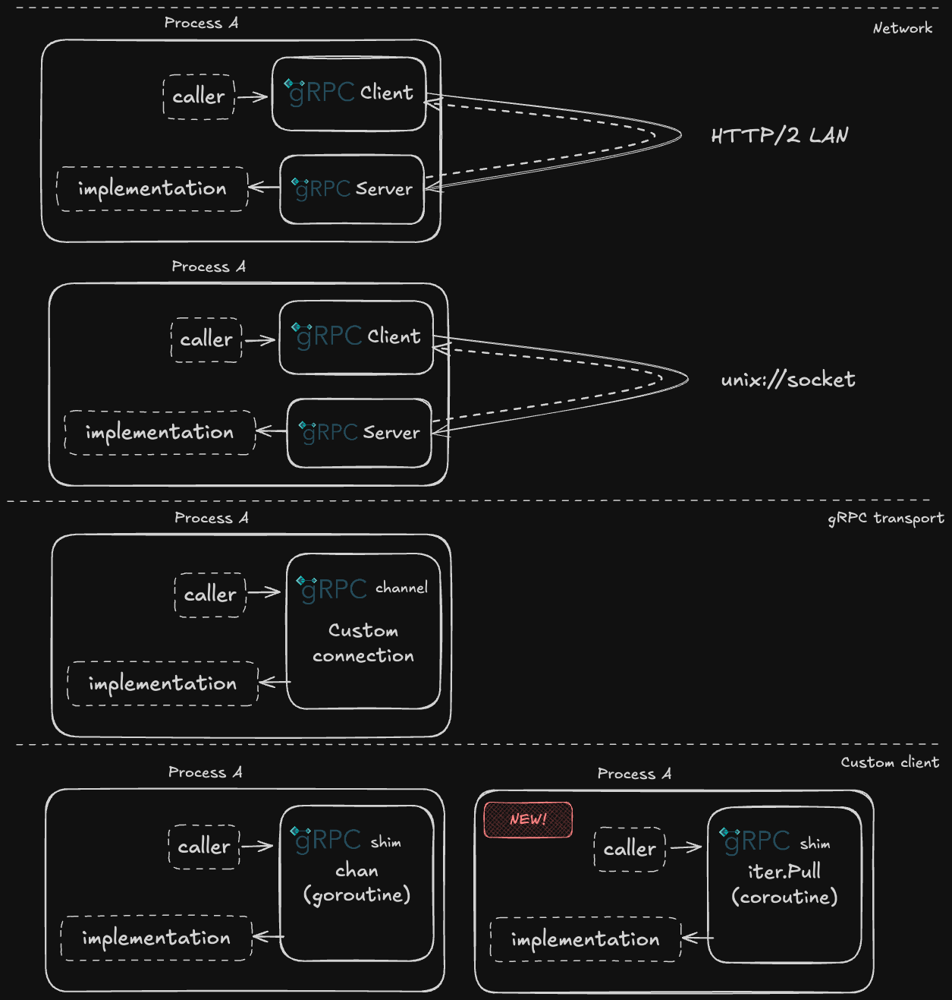

# 在进程内使用 Go 1.23 的 Iterators 和 Coroutines 优化 gRPC

<sub>
作者：Bartek Płotka @bwplotka，Filip Petkovski @fpetkovski
日期：2025-01-20
</sub>


几年前我（为 Thanos 项目）在 Go 中探索过[进程内 gRPC（in-process gRPC）](https://github.com/grpc/grpc-go/issues/906) 模式的若干方案。最近，一位朋友也是 Thanos 的维护者 [Filip](https://github.com/fpetkovski) 用 Go 1.23 的新迭代器（iterators）重写并刷新了[最初的 Thanos 方案](https://github.com/thanos-io/thanos/pull/7796)。

这给了我们一个完美的机会：在一篇联合博客中分享 Filip 和我关于新迭代器、新的 `coroutines`（注意：不是 `goroutines`！）以及在生产环境中实现进程内 gRPC 的可选方案所学到的东西。时间有限，那就把所有东西都放一篇博文里——会出什么乱子呢？(:

## Go 中的 gRPC

[gRPC](https://grpc.io/) 是一个流行的开源远程过程调用（RPC）框架，有几个独特点，比如与 [protobuf](https://protobuf.dev/) 的紧密集成、基于 HTTP/2、以及原生的双向流能力。在我们进入更高级的“进程内” gRPC 问题空间之前，先定义一个示例 gRPC 服务 —— 它以服务器流（server stream）的形式“列出”字符串：

```protobuf
service ListStrings {
  rpc List(ListRequest) returns (stream ListResponse) {}
}

message ListRequest {};

message ListResponse {
  repeated string strings = 1;
}
```

借助 [protoc](https://protobuf.dev/reference/go/go-generated/#invocation) 或 [buf](https://github.com/bwplotka/benchmarks/blob/9dd13b9e17bb935053a723ec4c88a6272759754b/benchmarks/local-grpc/buf.gen.yaml#L2)（像[这样调用](https://github.com/bwplotka/benchmarks/blob/9dd13b9e17bb935053a723ec4c88a6272759754b/benchmarks/local-grpc/Makefile#L12)），以及 Go 和 gRPC 插件，我们可以生成看起来像这样的 Go 客户端与服务端接口（以及对应的流接口）：

客户端：

```go
type ListStringsClient interface {
	List(ctx context.Context, in *ListRequest, opts ...grpc.CallOption) (grpc.ServerStreamingClient[ListResponse], error)
}

// Server-stream client allows receiving messages.
type ServerStreamingClient[T any] interface {
  Recv() (*T, error)
}
```

服务端：

```go
type ListStringsServer interface {
  List(*ListRequest, grpc.ServerStreamingServer[ListResponse]) error
}

// Server-stream server allows sending messages.
type ServerStreamingServer[T any] interface {
  Send(*T) error
}
```

有了这些，某段需要字符串的代码（“调用者”）可以使用 `List(ctx, &ListRequest{})` 方法来列出字符串。这会启动一个 gRPC（HTTP/2）流，允许通过 `Recv()` 方法接收字符串。另一端你可以实现 `ListStringsServer` 接口，通过 `Send(msg)` 方法向客户端推送字符串。

因此，你可以将服务部署在不同进程 / 不同机器之间，从一个进程向另一个进程传递数据：



## 透明的进程内 gRPC 调用

在 2020 年，Thanos 项目已有 3 年历史并已在其分布式设计中（若干微服务）大量使用 gRPC。我们开始[尝试不同的架构与抽象](https://github.com/thanos-io/thanos/commit/202fb4d46f35b91577bbc977d46c27f0e6f15e900)，以提高效率和可维护性。这时我们看到了对高效、同时又**透明**的“进程内” gRPC 流的需求。用上面提到的 `ListStrings` 示例来拆解我们指的是什么以及它能带来哪些帮助。

想象你需要一个服务，把多个 `ListStrings` 服务器封装并对外暴露为一个“代理”`ListStrings` 服务器。这是常见的 fan-out（扇出）模式，适用于实现服务端的高级逻辑，例如过滤、去重、负载均衡、数据分片，甚至[请求对冲（request hedging）](https://dzone.com/articles/request-hedging-applicability-benefits-trade-offs)。你可以把它部署为单独进程，它既对外提供 `ListStrings` 服务，也调用多个远程的 `ListStrings` 服务。

然而，我们注意到一些把部分服务器嵌入同一进程的用例。例如：

- 在客户端侧嵌入同样的代理 `ListStrings` 服务（例如用于内存内分片或客户端负载均衡）。
- 在代理 `ListStrings` 所在进程中嵌入某些 `ListStrings` 服务器，使代理对本地和远程服务器使用同一套逻辑（对用户透明）。
- 测试（避免需要完整的 HTTP 服务端与客户端）。

高效地解决这个用例（如[#906 issue](https://github.com/grpc/grpc-go/issues/906) 所抓取的）并不像你想的那样简单，尤其是对于数据量大的 gRPC 调用（比如在 Thanos 中我们会从一个服务向另一个服务按 GB/s 的速率流式传输指标）。gRPC 框架是为“远程”调用设计的（字面上 gRPC 名字里的 R）。例如，注意你不能仅仅用实现 `ListStringsServer` 的相同代码去实现 `ListStringsClient`。关键差别实际上在于服务流接口：`ServerStreamingClient[T any]` vs `ServerStreamingServer[T any]`。前者（客户端）通过 `Recv()` **拉取（pull）** 消息；后者（服务端）通过 `Send(...)` **推送（push）** 消息。

最初，为什么这对进程内执行会构成问题可能不直观。客户端在等待数据，服务端最终会推送数据。我们期望什么？技术上说，对于**顺序执行**来说，若客户端能 **拉取** 并且服务端能 **实现拉取接口**，或者客户端实现 **推送接口** 且服务端 **推送**，那会更好。

为什么？因为将对数据流的拉（pull）与推（push）混合起来，会需要：

- 为所有消息做**同步和缓冲**，这违背了异步流的初衷。如果你接受同步行为，就不必使用 gRPC 的服务器流了，进程内问题也不再是问题——但本文不讨论同步方案。
- 一个**媒介**（共享网络、共享内存或 Go 通道）以及**并发**（进程或 goroutine），这会带来额外开销。

### 五种选项

长话短说，目前我们有五种实用选项：



1. 进程通过本地回环地址（localhost）调用自身的 gRPC 服务（HTTP 端口）。
2. 进程通过 Unix 域套接字（Unix socket）调用自身的 gRPC 服务。
3. 使用优秀的 [`grpchan/inprocgrpc`](https://pkg.go.dev/github.com/fullstorydev/grpchan%40v1.1.1/inprocgrpc) gRPC 通道实现。gRPC 的通道（channel）可以被看作是 TCP 传输的一层抽象，可以被替换为自定义实现。
4. 实现一个自定义客户端，使用单个 Go 通道加另一个 goroutine 将 `Send(...)` 与 `Recv()` 集成起来。
5. 自 Go 1.23 起，我们可以使用令人兴奋的新 `iter` 包来 **拉取（receive）** `Send(...)` 调用，本文就要进一步探索这种方法！

如果你迫不及待想知道每个方案的优缺点，可以直接跳到[总结](#summary)。否则我们继续讲新迭代器以及它们如何帮助解决进程内 gRPC 的挑战！💪

## Go 1.23 的 `iter` 包和 coroutines

_Filip_：引入 coroutines 的理由在 Russ Cox 的文章 [Coroutines for Go](https://research.swtch.com/coro) 中已有描述。主要动机是让开发者能够编写既安全又高效的迭代器。与 goroutine 的关键区别在于：coroutine 引入的是**并发性而非并行性**。换句话说，coroutine 无法被其他 coroutine 抢占（preempted）。它们只会在程序中的显式点切换（并恢复另一个 coroutine）。另一种常见的总结是：goroutines 用于并发工作（working concurrently），coroutines 用于并发等待（waiting concurrently）。

正是这种差别常常能解锁更高效的实现，因为不需要使用像通道或锁这样的同步原语。调度也更便宜，因为不存在抢占。更具体地说，Russ 报告说基于 coroutine 的迭代器在读取值时比用 goroutine+channel 的方案快 10 倍（或每次读取 20ns vs 400ns）。这些绝对数值看起来可能小，但在高吞吐环境（服务器每秒需要处理数千请求）中容易累积成显著差异。goroutine + channel 的另一个缺点是会产生更多垃圾（garbage），从而增加垃圾回收压力。

coroutines 在 Go 1.23 的运行时中被加入，并通过 `iter` 包对外提供支持。该包新增了两种类型：`iter.Seq` 和 `iter.Seq2`，可用于实现分别返回一个值或两个值的迭代器。开始使用迭代器最简单的方法是实现一个满足这两种类型之一的函数，并在 for 循环中使用它。下面是一个逐行读取文件的简单迭代器实现（也在 [playground](https://go.dev/play/p/TQDfn88AoAU)）：

```go
var lineReader iter.Seq2[string, error] = func(yield func(item string, err error) bool) {
    f, err := os.Open(filePath)
    if err != nil {
        yield("", err)
    }
    defer f.Close()

    scanner := bufio.NewScanner(f)
    for scanner.Scan() {
        if !yield(scanner.Text(), nil) {
        }
    }
    if err := scanner.Err(); err != nil {
        yield("", err)
    }
}

for line, err := range lineReader {
    if err != nil {
        // handle err
    }
    // use line
}
```

注意我们可以在迭代器函数里打开文件，并在完成读取后用 `defer` 关闭它。这令迭代器安全易用，因为调用方无需担心清理资源，清理逻辑已封装在迭代器实现中。

消费迭代器最简单的方式是用 `for range` 遍历它。但有时我们需要更细粒度地控制何时、如何读取值。例如，在上文描述的进程内 gRPC 客户端实现中，我们需要在一个基于推（push）的 API 之上实现一个基于拉（pull）的 API。`range` 关键字会自动为我们完成这件事，但我们也可以使用 `iter.Pull` 和 `iter.Pull2` 来获得显式控制。例如，不用 for-loop 而使用我们前面的 `lineReader` 可以这样（见 [playground](https://go.dev/play/p/3IpQrwbEzWw)）：

```go
next, stop := iter.Pull2(lineReader)
defer stop()
for {
    line, err, ok := next()
    if !ok {
        break
    }
    if err != nil {
        // handle err
	}
    // use line
}
```

注意 `iter.Pull2` 会返回一个 `stop` 函数，可以在任何时候调用以终止迭代器。以这种方式消费迭代器更灵活，但必须确保迭代器被完全耗尽，或者一旦调用方不再关心下一个值就调用 `stop`。否则，迭代器函数可能永远不会终止，导致资源泄露。

### 用 `iter` 的实现

利用这些概念，我们将进程内客户端实现[重写为使用 coroutine（而不是 goroutine + channel）](https://github.com/thanos-io/thanos/pull/7796/files#diff-3e3656359cc24ff074e50571d47b0b7fa4229f2be8fc0511b126d91c94fa4883)。迭代器函数打开的是本地的服务器流（server stream），它是基于 push 的（依赖 gRPC 框架的 `Send` 方法）。客户端则提供 `Recv`，是基于 pull 的。正如上文所述，我们可以优雅地用 `iter.Pull2` 将一个基于 push 的实现转换为基于 pull 的迭代器，并将其交给客户端使用。我们最初的实现中有一个细微的 bug：当查询被取消时客户端未调用 `stop`，导致 reader 永远保持打开，在特定情形下造成死锁。这是一个很好的教训，说明在“非 happy path”下（比如不使用 `range`）消费迭代器的缺点。

为了展示 `iter` 包在进程内 gRPC 场景下的可用性，来看 `ListStrings` 的实现。`newServerAsClient` 允许用客户端 gRPC 接口去调用 `ListStrings` 服务器。实现相对简单（也看 [playground](https://go.dev/play/p/MEz1qN63p72)）：

```go
func newServerAsClient(srv ListStringsServer) ListStringsClient {
	return &serverAsClient{srv: srv}
}

type serverAsClient struct {
	srv ListStringsServer
}

func (c *serverAsClient) List(ctx context.Context, in *ListRequest, _ ...grpc.CallOption) (grpc.ServerStreamingClient[ListResponse], error) {
	y := &yielder{ctx: ctx}

	// Pull from iter.Seq2[*ListResponse, error].
	y.recv, y.stop = iter.Pull2(func(yield func(*ListResponse, error) bool) {
		y.send = yield
		if err := c.srv.List(in, y); err != nil {
			yield(nil, err)
			return
		}
	})
	return y, nil
}

type yielder struct {
    grpc.ServerStreamingClient[ListResponse]
	grpc.ServerStreamingServer[ListResponse]

	ctx context.Context

	send func(*ListResponse, error) bool
	recv func() (*ListResponse, error, bool)
	stop func()
}

func (y *yielder) Context() context.Context { return y.ctx }

func (y *yielder) Send(resp *ListResponse) error {
	if !y.send(resp, nil) {
		return errors.New("iterator stopped receiving")
	}
	return nil
}

func (y *yielder) Recv() (*ListResponse, error) {
	r, err, ok := y.recv()
	if err != nil {
		y.stop()
		return nil, err
	}
	if !ok {
		return nil, io.EOF
	}
	return r, nil
}
```

## 哪个选项最好？

综上，`iter` 是进程内 gRPC 用例中对我们来说目前最合适的方案，但工程上很少存在单一通用的“最佳”方案，我们还是回顾下[五个选项](#five-options)及其优劣。

| 选项                   | `ListStrings`                                                                                                                             | 优点                                                                                                                                           | 缺点                                                                                            |
| ---------------------- | ----------------------------------------------------------------------------------------------------------------------------------------- | ---------------------------------------------------------------------------------------------------------------------------------------------- | ----------------------------------------------------------------------------------------------- |
| 1. localhost           | [实现](https://github.com/bwplotka/benchmarks/blob/9dd13b9e17bb935053a723ec4c88a6272759754b/benchmarks/local-grpc/benchmark_test.go#L121) | 与 proto 定义无关，兼容性最好（完整 gRPC 逻辑），使用简单。                                                                                    | 昂贵，消息会泄露到进程外。                                                                      |
| 2. unix socket         | [实现](https://github.com/bwplotka/benchmarks/blob/9dd13b9e17bb935053a723ec4c88a6272759754b/benchmarks/local-grpc/benchmark_test.go#L138) | 与 proto 定义无关，兼容性最好（完整 gRPC 逻辑），比 localhost 开销稍小，简单易用。                                                             | 仍然昂贵，消息泄露到进程外，不完全可移植（例如较旧的 Windows 版本）。                           |
| 3. grpchannel          | [实现](https://github.com/bwplotka/benchmarks/blob/9dd13b9e17bb935053a723ec4c88a6272759754b/benchmarks/local-grpc/benchmark_test.go#L166) | 与 proto 定义无关，避免昂贵的 proto 序列化，完全进程内，避免 HTTP 服务/客户端开销，支持 gRPC 提供的大多数超时、trailer 和 metadata，使用简单。 | 有开销，尤其是默认的消息克隆（cloning）。                                                       |
| 4. channel + goroutine | [实现](https://github.com/bwplotka/benchmarks/blob/9dd13b9e17bb935053a723ec4c88a6272759754b/benchmarks/local-grpc/benchmark_test.go#L229) | 几乎是最高效的方案之一。                                                                                                                       | 很难做到完全通用并支持 gRPC 的 trailers 和 metadata，容易出现并发错误（goroutine 泄露、死锁）。 |
| 5. iter + coroutine    | [实现](https://github.com/bwplotka/benchmarks/blob/9dd13b9e17bb935053a723ec4c88a6272759754b/benchmarks/local-grpc/benchmark_test.go#L298) | 最高效，且实现相对简单。                                                                                                                       | 很难做到完全通用，难以正确支持 gRPC 的 trailers 和 metadata。                                   |

为了验证每种方案的大致效率，我们对每个 `ListStrings` 实现做了[微基准测试（micro-benchmarks）](https://github.com/bwplotka/benchmarks/tree/38a20655422b0152a4953edc288c1edfcca25500/benchmarks/local-grpc)，通过流式传输 10k 个字符串（总计 10 MB）。结果显示 `iter` 方案最快，即便它在常量分配上比我们自定义的 goroutine 实现略有（可忽略）更多的分配：

```
benchstat -col /impl -filter "/respSize:1 /impl:(localhost OR unixsocket OR grpchannel-nocpy OR chan OR iter)" ./bench01-2025.txt
goos: darwin
goarch: arm64
pkg: github.com/bwplotka/benchmarks/benchmarks/local-grpc
cpu: Apple M1 Pro
                   │  localhost   │          unixsocket           │          grpchannel-nocpy          │                chan                │                iter                │
                   │    sec/op    │    sec/op     vs base         │   sec/op     vs base               │   sec/op     vs base               │   sec/op     vs base               │
Local/respSize=1-2   10.333m ± 7%   9.800m ± 31%  ~ (p=0.132 n=6)   5.862m ± 5%  -43.27% (p=0.002 n=6)   4.500m ± 8%  -56.45% (p=0.002 n=6)   2.222m ± 3%  -78.50% (p=0.002 n=6)

                   │   localhost    │              unixsocket              │           grpchannel-nocpy           │                chan                │               iter                │
                   │      B/op      │      B/op       vs base              │     B/op       vs base               │    B/op     vs base                │    B/op     vs base               │
Local/respSize=1-2   7479835.0 ± 0%   7055631.0 ± 0%  -5.67% (p=0.002 n=6)   482182.5 ± 0%  -93.55% (p=0.002 n=6)   320.0 ± 0%  -100.00% (p=0.002 n=6)   504.0 ± 0%  -99.99% (p=0.002 n=6)

                   │    localhost    │              unixsocket               │           grpchannel-nocpy            │                chan                │                iter                │
                   │    allocs/op    │    allocs/op     vs base              │   allocs/op     vs base               │ allocs/op   vs base                │  allocs/op   vs base               │
Local/respSize=1-2   160279.000 ± 0%   160952.500 ± 0%  +0.42% (p=0.002 n=6)   10034.000 ± 0%  -93.74% (p=0.002 n=6)   4.000 ± 0%  -100.00% (p=0.002 n=6)   15.000 ± 0%  -99.99% (p=0.002 n=6)
```

### 总结

总之，[`grpchan/inprocgrpc`（选项 3）](https://pkg.go.dev/github.com/fullstorydev/grpchan%40v1.1.1/inprocgrpc) 是一个功能完备且相对稳健的解决方案：它与 proto 无关并支持大多数 gRPC 内部机制。若想在此上进一步挤出性能，可以实现[自定义的 no-op cloner](https://github.com/bwplotka/benchmarks/blob/38a20655422b0152a4953edc288c1edfcca25500/benchmarks/local-grpc/benchmark_test.go#L175)，以避免昂贵的消息复制 —— 对于不复用消息的调用方和服务端，这通常很容易实现且可省去复制成本。

然而，如果你的 gRPC 服务是数据敏感的且位于性能关键路径（hot path），可以考虑使用 Go 新的 [iter（选项 5）](https://pkg.go.dev/iter) 包来实现进程内 gRPC，当前看来它是最有效的方案。因此我们在 Thanos 项目中选择了 `iter` 方案。实现相对简单，但比 [`grpchan/inprocgrpc`](https://pkg.go.dev/github.com/fullstorydev/grpchan%40v1.1.1/inprocgrpc) 略微复杂一些。

希望这篇文章能让你对 Go 的 `iter` 包有更多了解，并激励你用它构建精彩的东西！如果你有问题、反馈或想分享你用这些知识做了什么精彩的项目，欢迎联系！

感谢 [Maria Letta 提供美丽的 Gopher 插图](https://github.com/MariaLetta/free-gophers-pack) 以及 Go 社区为 `iter` 包和相关资源（例如 [range-functions 博文](https://go.dev/blog/range-functions)、[Russ Cox 的一系列文章](https://research.swtch.com/coro)）做出的贡献。

再见！
