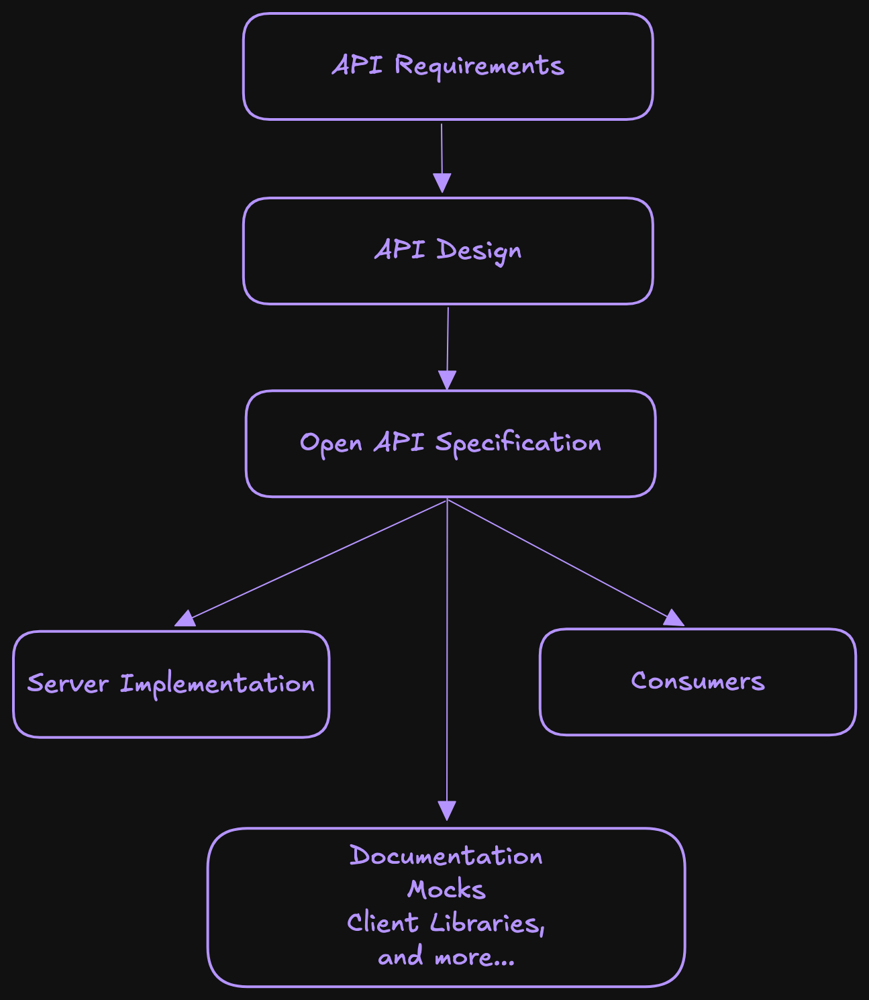
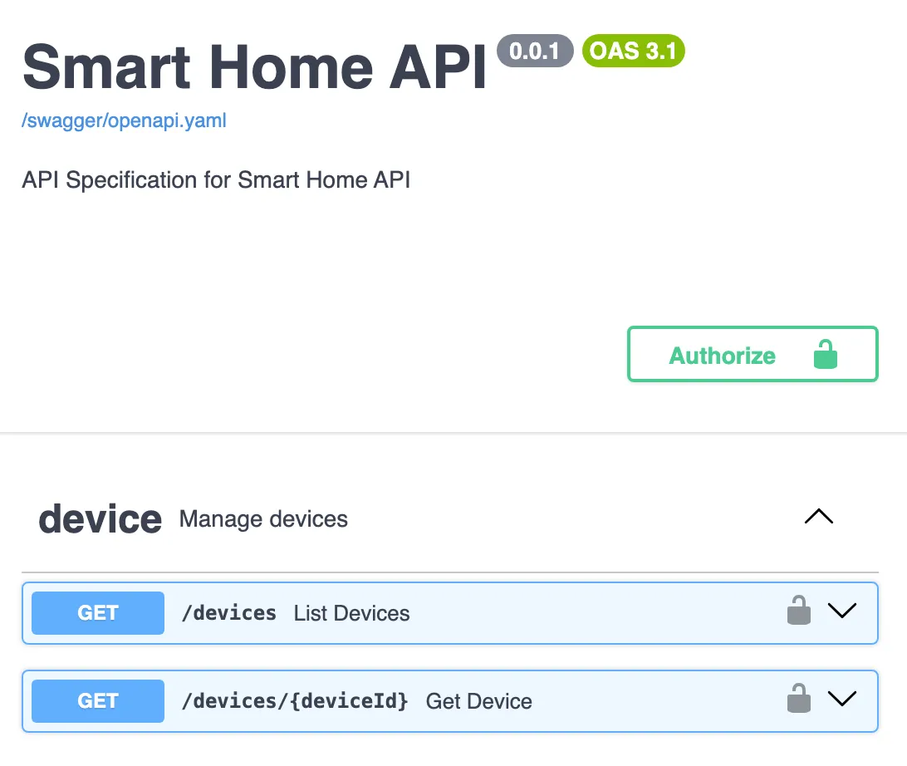

# Practical OpenAPI in Go

> From OpenAPI Specification to Go Server.

[Watch on YouTube](https://www.youtube.com/watch?v=87au30fl5e4)

#### Share this post

Well-structured and documented APIs are pleasure to work with. And nowadays the de-facto standard is [OpenAPI](https://www.openapis.org/), which comes with a good methodology of defining an API interface first, and only then constructing everything around it. Making it easier to understand, implement, and consume those APIs. And standards matter, they allow different teams, regardless of their technology stack, to effectively communicate about and work with the same API.



In this practical guide I want to walk you through all important parts involved in architecting, implementing and consuming the API with help of OpenAPI standard.

Before we dive in, it's helpful to have a basic understanding of the following:

- Go programming language
- RESTful APIs
- JSON/YAML
- Basic command-line usage

## What is OpenAPI and OAS?

The [OpenAPI Specification (OAS)](https://spec.openapis.org/) was originally based on the Swagger 2.0 Specification from SmartBear Software. Later it was moved to the [OpenAPI Initiative (OAI)](https://www.openapis.org/), a consortium of industry experts under the Linux Foundation.

The main idea of OpenAPI is to be able to describe in agnostic terms, decoupling them from any specific programming language. Consumers of your API specification do not need to understand the guts of your application or try to learn Lisp or Haskell if that's what you chose to write it in. They can understand exactly what they need from your API specification, written in a simple and expressive language.

This simple and expressive language is called [DSL (domain specific language)](https://www.jetbrains.com/mps/concepts/domain-specific-languages/). It can be written in either JSON or YAML.

The latest version of OAS is [v3.1.1](https://spec.openapis.org/oas/latest.html) and the specification itself is huge, there are many features and corner cases, but we will try to go through the most important ones.

## Architecting the API

It all starts with defining what the API should provide for its consumers and what it is for. While this stage isn't always purely technical, having a sketch of your API design in OAS when gathering requirements gives you a headstart when starting design.

Once the requirements are ready, it's time to open your [OpenAPI editor](https://editor.swagger.io/) and collaborate with your teammates.

And it's important to understand that it's not only about writing JSON/YAML spec, but actually agreeing on the API design.

It's recommended to follow some API design guide, Google has [one](https://cloud.google.com/apis/design) for example. So you don't end up having mixed styles like **/resourceName/{id}** and **/resource_name/{id}**, inconsistent use of HTTP methods, or unclear resource relationships.

## openapi.yaml

The spec of your API starts in the entrypoint document `openapi.yaml` (recommended but not required name) or `openapi.json`. I've seen very big `openapi.yaml` files (50k lines), but it's possible to split your spec into multiple parts. However, this may not work well for some OpenAPI tools as they expect a single file. [Google Maps OAS](https://github.com/googlemaps/openapi-specification/) is a good example on how to split the schema, but also comes with a pre-processor to generate a single file.

There are some open source tools to bundle the OAS: [swagger-cli](https://github.com/APIDevTools/swagger-cli) (archived) and [redocly-cli](https://github.com/Redocly/redocly-cli) are great options.

```bash
swagger-cli bundle -o _bundle/openapi.yaml openapi.yaml
```

As I mentioned earlier, the spec is huge, but let's break it into smaller parts. For this post I created a dummy "Smart Home" API, you can see the full spec and code [here](https://github.com/plutov/packagemain/tree/master/oapi-example).

The root object is called [OpenAPI Object](https://spec.openapis.org/oas/latest.html#openapi-object) and has the following structure:

```yaml
# schema version
openapi: 3.1.1

# docs
info:
  title: Smart Home API
  description: API Specification for Smart Home API
  version: 0.0.1

# optional servers for public APIs
servers:
  - url: "https://..."

# tags are used to group the endpoints
tags:
  - name: device
    description: Manage devices
  - name: room
    description: Manage rooms

# endpoints go here
paths:
  # ...

# reusable objects such as schemas, error types, request bodies
components:
  # ...

# security mechanisms, should correspond to components.securitySchemes
security:
  - apiKeyAuth: []
```

We defined the skeleton of our schema, but the majority of OpenAPI schema lays in `paths` and `components` props.

## Paths and Operations

Let's now add few endpoints to our schema. The operations are grouped by paths, so you can have multiple HTTP methods on a single path, for example `GET /devices/{deviceId}` and `DELETE /devices/{deviceId}`.

It's a good practice to define all types (request bodies, responses, errors) in `components` section and reference them instead of manually defining them in `paths` section. This allows for easier re-use of entities. For example in our API we have a type `Device` which can be used in many endpoints.

```yaml
paths:
  # the path has a parameter in it
  /devices/{deviceId}:
    get:
      tags:
        - device
      summary: Get Device
      operationId: getDevice

      parameters:
        - name: deviceId
          in: path
          required: true
          schema:
            $ref: "#/components/schemas/ULID"

      responses:
        "200":
          description: Success
          content:
            application/json:
              schema:
                $ref: "#/components/schemas/Device"

        "404":
          description: Not Found
          content:
            application/json:
              schema:
                # use common type for 404 errors
                $ref: "#/components/schemas/ErrorNotFound"
```

In the spec above we defined two endpoints of our API and referenced the types which we still need to define: `Device`, `ErrorNotFound` and `ULID`. Notice that for `deviceId` path param we also used a custom type instead of a standard string, which can be helpful in the future in case we want to change the format of our IDs (for example UUID, ULID. integer, etc.).

Notice that each operation has a unique `operationId`, while it's optional it's very helpful to set one, so then it can be used on the server and client sides.

This is a basic configuration and can be extended further if we want to. For example, when serving this schema in Swagger, it's good to see the examples of our requests (and their variations). We can define it here in `responses` section, or directly in our `components.schemas`.

```yaml
responses:
  "200":
    content:
      application/json:
        examples:
          new_device:
            value: # any value
```

## Schemas

`components` is an integral part of OAS, it contains the following properties:

- schemas
- responses
- parameters
- requestBodies
- headers
- securitySchemes
- [see all here](https://spec.openapis.org/oas/latest.html#components-object)

We could define our `Device` type like this:

```yaml
components:
  schemas:
    Device:
      type: object
      properties:
        id:
          $ref: "#/components/schemas/ULID"
        name:
          type: string
      required:
        - id
        - name
```

But later you may have other types that have `name` or `id` fields, so it's recommended to define them separately and combined in final type using `allOf`:

```yaml
components:
  schemas:
    WithId:
      type: object
      required:
        - id
      properties:
        id:
          $ref: "#/components/schemas/ULID"

    WithName:
      type: object
      required:
        - name
      properties:
        name:
          type: string

    Device:
      allOf:
        - $ref: "#/components/schemas/WithId"
        - $ref: "#/components/schemas/WithName"
```

`allOf`, `oneOf` and `anyOf` are very powerful techniques for modelling your OAS.

### Extensions

OpenAPI schema can be extended with internal properties that do not affect the schema itself, but are useful for server or client generators. A good example is our [ULID](https://github.com/ulid/spec) type for ids:

```yaml
ULID:
  type: string
  minLength: 26
  maxLength: 26

  # example is useful for Swagger docs
  example: 01ARZ3NDEKTSV4RRFFQ69G5FAV

  x-go-type: ulid.ULID
  x-go-type-import:
    path: github.com/oklog/ulid/v2
```

The `x-` props will be used by Go server generator to use existing Go types for this field instead of generating a new one.

## Generate a Go Server

We didn't go through all possible schema properties and just covered the main ones, so people who are not familiar with OAS have a good understanding of this standard. You can read the whole specification [here](https://spec.openapis.org/oas/latest.html). But now as our schema is ready we can generate a Go server from it.

You can find the full list of generators on [opeanapi.tools](https://openapi.tools/), there are a lot of them. However, the most popular one for Go servers is [oapi-codegen](https://github.com/oapi-codegen/oapi-codegen).

> oapi-codegen currently doesn't support OAS 3.1. [Issue](https://github.com/oapi-codegen/oapi-codegen/issues/373)
>
> [ogen](https://github.com/ogen-go/ogen/) does, however.

You can install it via `go install`:

```bash
go install github.com/oapi-codegen/oapi-codegen/v2/cmd/oapi-codegen@latest
```

The configuration for the `oapi-codegen` generator is straightforward. You can either provide command line arguments or specify the same arguments in a yaml configuration file. You can choose which HTTP router to use for the server, where to put the output file, and more. In our case let's use [echo](https://github.com/labstack/echo) router.

```yaml
# oapi-codegen.yaml

package: api
output: pkg/api/api.gen.go

generate:
  strict-server: true
  models: true
  echo-server: true
```

We can now generate the server code using the following command:

```bash
oapi-codegen --config=oapi-codegen.yaml openapi.yaml
```

Let's explore now the generated `api.gen.go` file. It contains the following parts.

Since we enabled `strict-server`, which will generate code that parses request bodies and encodes responses automatically, the interface that we need to implement is called `StrictServerInterface`:

```go
type StrictServerInterface interface {

  // List Devices
  // (GET /devices)
  ListDevices(ctx context.Context, request ListDevicesRequestObject) (ListDevicesResponseObject, error)

  // Get Device
  // (GET /devices/{deviceId})
  GetDevice(ctx context.Context, request GetDeviceRequestObject) (GetDeviceResponseObject, error)

}
```

All our types are also generated:

```go
type ULID = ulid.ULID

type Device struct {
	Id   ULID   `json:"id"`
	Name string `json:"name"`
}

// ...
```

As well as:

- Code to parse the requests automatically
- Swagger definition

### Implementation

What's left for us to do is to create a server using echo, implement the generated interface and glue everything together. We can write the following code in `pkg/api/impl.go`:

```go
package api

import "context"

type Server struct{}

func NewServer() Server {
	return Server{}
}

func (Server) ListDevices(ctx context.Context, request ListDevicesRequestObject) (ListDevicesResponseObject, error) {
	// actual implementation
	return ListDevices200JSONResponse{}, nil
}

func (Server) GetDevice(ctx context.Context, request GetDeviceRequestObject) (GetDeviceResponseObject, error) {
	// actual implementation
	return GetDevice200JSONResponse{}, nil
}
```

I skipped the implementation part and just demonstrated how to return the responses, it's quite handy that `oapi-codegen` generated all possible responses for us.

That leaves us to start the echo server itself. Note that we don't need to write any endpoints manually now, and all request and response parsing is handled for us. Still, we need to validate the requests inside our implementation.

```go
package main

import (
	"oapiexample/pkg/api"

	"github.com/labstack/echo/v4"
)

func main() {
	server := api.NewServer()

	e := echo.New()

	api.RegisterHandlers(e, api.NewStrictHandler(
		server,
		// add middlewares here if needed
		[]api.StrictMiddlewareFunc{},
	))

	e.Start("127.0.0.1:8080")
}
```

Now when we run our server using go run . we can curl `localhost:8080/devices` to se the response!

### Supported servers

`oapi-codegen` supports many web frameworks/servers, such as Chi, Fiber, Gin as well as standard `net/http`.

### Swagger UI / Postman

Sometimes it's handy to have Swagger docs shipped together with your API, for testing for example or just as public documentation. `oapi-codegen` doesn't generate the Swagger UI out of the box but we can have a simple html page that has a Swagger JS which loads our OAS.

You can find the html code for our `pkg/api/index.html` [here](https://swagger.io/docs/open-source-tools/swagger-ui/usage/installation/).

And then we can use `go:embed` to embed the static files and add our swagger endpoint:

```go
//go:embed pkg/api/index.html
//go:embed openapi.yaml
var swaggerUI embed.FS

func main() {
	// ...

	// serve swagger docs
	e.GET("/swagger/*", echo.WrapHandler(http.StripPrefix("/swagger/", http.FileServer(http.FS(swaggerUI)))))
}
```

Now we can visit `localhost:8080/swagger/` to see the Swagger UI with our OAS.



Tools like Postman are very popular for API documentation, and it's also possible to [import](http://learning.postman.com/docs/integrations/available-integrations/working-with-openAPI/) your existing OpenAPI 3.0 and 3.1 definitions into Postman. Postman supports both YAML and JSON formats.

### Generate OAS from code

There is also a practice to generate OpenAPI schema from code, especially in typed languages. This approach has been popular, with the main selling point that keeping OpenAPI schema near the code will hopefully mean developers keep it up to date as they work on the code. This is not always the case, which is one of a few reasons this practice is dying out. And I am also not a big fan of that as I haven’t seen a big value in this. Anyway, you can have a look at the following projects: [go-swagger](https://github.com/go-swagger/go-swagger), [swag](https://github.com/swaggo/swag), [swaggest/rest](https://github.com/swaggest/rest/).

## Client Code

As mentioned earlier, OpenAPI is very powerful for collaboration between teams, and all you have to do now is to properly version your schema (see `info.version` part) and distribute it across the teams. This part can be automated to some extent by packaging your OpenAPI schema and making it available. I've seen that devs use git submodules for that or GitHub actions to publish the version schemas.

Let's assume our client is a web application written in Typescript, which is quite common for web APIs. Again, there are may generators available at [opeanapi.tools](https://openapi.tools/) online but the most popular one is [openapi-typescript](https://openapi-ts.dev/).

Here's how you can generate the Typescript code for local or remote schemas:

```bash
# Local schema
npx openapi-typescript openapi.yaml -o ./client/schema.d.ts

# Remote schema
npx openapi-typescript https://.../openapi.yaml -o ./client/schema.d.ts
```

## Conclusion

OpenAPI is a de-facto standard for designing, implementing and consuming the REST APIs, so it's crucial to understand how it works. I hope this article has provided a useful introduction to OpenAPI Specification, as well as practical tips and examples for how to use OAS to architect, implement and consume APIs.

## Resources

- [Watch on YouTube](https://www.youtube.com/watch?v=87au30fl5e4)
- [Source code](https://github.com/plutov/packagemain/tree/master/oapi-example)
- [OpenAPI Initiative](https://www.openapis.org/)
- [openapi.tools](https://openapi.tools/)
- [Swagger Editor](https://editor.swagger.io/)
- [oapi-codegen](https://github.com/oapi-codegen/oapi-codegen)
