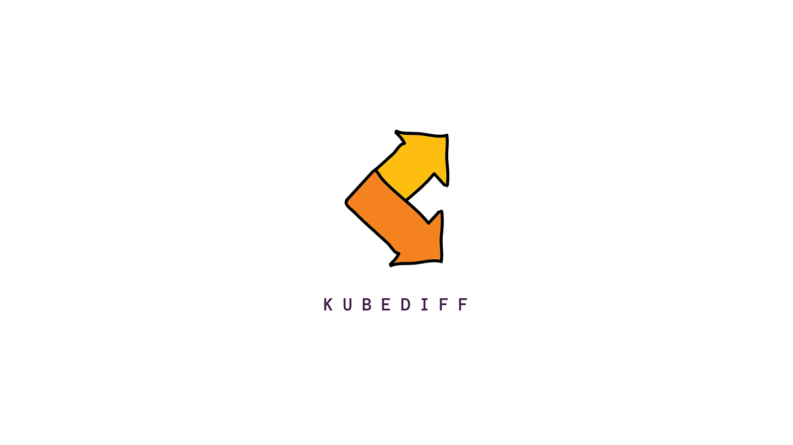
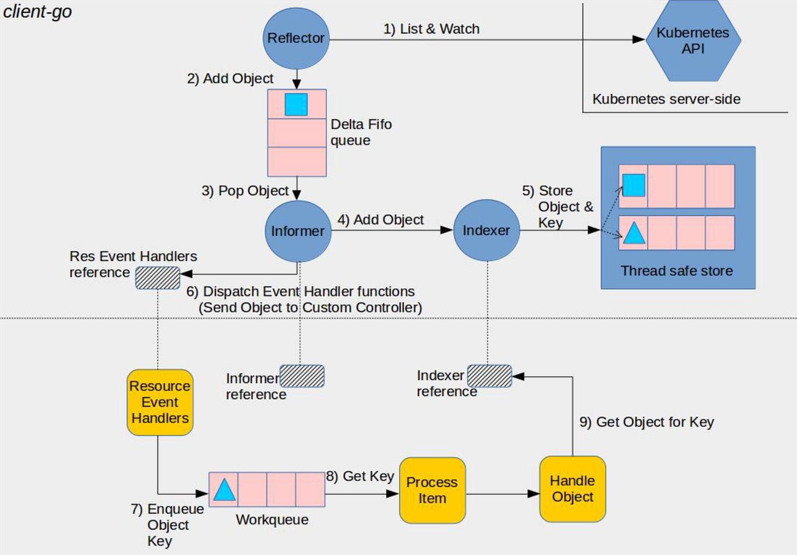

# A Deep Dive Into Kubernetes Informers

_By Farhan - October 03, 2021_



I wanted to understand more about how Kubernetes controllers are implemented. Building controllers with **[controller-runtime](https://github.com/kubernetes-sigs/kubebuilder)** is pretty easy but it masks many details on how the event-oriented architecture of client-go works underneath.

## What are informers?

The vital role of a Kubernetes controller is to watch objects for the desired state and the actual state, then send instructions to make the actual state be more like the desired state. But how does the controller retrieve the object's information?

In order to retrieve an object's information, the controller sends a request to Kubernetes API server.

However, continuous polling for retrieving information on the resources can degrade the performance of the API server. To stay informed about when these events get triggered **[client-go](https://github.com/kubernetes/client-go)** provides **Informers** which solve this problem. Informers query the resource data and store it in a local cache. Once stored, an event is only generated when it detects a change in the object (or resource) state.

If you are confused on how this glues in to a controller, [here](https://github.com/kubernetes/sample-controller/blob/master/docs/images/client-go-controller-interaction.jpeg) is a diagram to explain the flow.



## How Does It Work?

A single informer creates a local cache for itself. But in reality, a single resource could be watched by multiple controllers. And if each controller creates a cache for itself, there are synchronisation issues as multiple controllers have a watch on their own cache. **[client-go](https://github.com/kubernetes/client-go)** provides a **Shared Informer** which is used so that the cache is shared amongst all controllers. Every built-in Kubernetes resource has an Informer.

The informer mechanism has three components:

- **Reflector**: Watches specific resources like certain CRD, and puts events, such as `Added`, `Updated`, and `Deleted`, into the local cache `DeltaFIFO`.
- **DeltaFIFO**: A FIFO queue to store the related resource events.
- **Indexer**: It is the local storage implemented by client-go, keeping consistent with the etcd, reducing the pressure of the API Server and etcd.

To create a shared informer you can use **DynamicSharedInformerFactory** function available in `k8s.io/client-go/informer/dynamic/dynamicinformer` package which returns a factory of the dynamic informers that can be created. A DynamicSharedInformerFactory provides access to a shared informer and lister for a dynamic client.

```go
stopCh := make(chan struct{})
defer close(stopCh)

informer := dynamicinformer.NewFilteredDynamicSharedInformerFactory(
				dynamicClient,
				resyncPeriod,
				namespace,
				nil,
			)
```

Let's break this code down. This informer is created for a particular namespace. If you'd like to watch all namespaces, you can set this to an empty string. Once the informer is set, you need to add an event handler to inject the logic that you'd like to execute when an object is Added/Updated/Deleted. You can do that easily:

```go
var handler cache.ResourceEventHandlerFuncs
handler.AddFunc = func(obj interface{}) {
	log.Info("add event")
}
handler.UpdateFunc = func(old, new interface{}) {
	log.Info("update event")
}
handler.DeleteFunc = func(obj interface{}) {
	log.Info("delete event")
}

informer.AddEventHandler(handler)

informer.Start(stopCh)
```

Pretty simple right? Once this is done, you are ready to watch for events in the specified namespaces. Understanding the working layers of **[client-go](https://github.com/kubernetes/client-go)** gives you tools to interact with the API server and create custom tools for yourself. One such tool that I've written is called **[kubediff](https://github.com/arriqaaq/kubediff)**

## Writing Your Own Informers

**[kubediff](https://github.com/arriqaaq/kubediff)** is a Kubernetes resource diff watcher, with the ability to send event notifications to slack/webhooks. Using the same informer logic, kubediff watches for all resources (including CRDs) and generated events, which you can send to a webhook or slack channel. It logs the events in a JSON format, so that makes it easy for you to send the logs directly to your preferred logging stack and then view the diff in objects whenever they are updated.

You can also create a watch on a single namespace, or multiple namespaces. If you want update on all the events, you can simply run kubediff in watch mode and it will update you for all the events when an object is Created/Deleted/Updated.

If you'd like to understand more about informers and play with it, do checkout out kubediff, clone/fork and tweak with the informer settings to checkout the event-driven mechanism implemented in client-go.

[GitHub - arriqaaq/kubediff: A Kubernetes Resource Diff](https://github.com/arriqaaq/kubediff)
