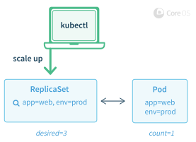
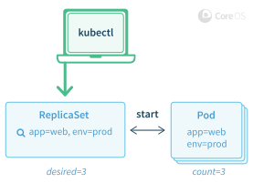
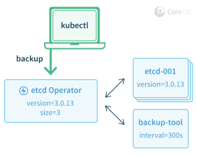

# Introducing Operators: Putting Operational Knowledge into Software

A Site Reliability Engineer (SRE) is a person that operates an application by writing software. They are an engineer, a developer, who knows how to develop software specifically for a particular application domain. The resulting piece of software has an application's operational domain knowledge programmed into it.

Our team has been busy in the Kubernetes community designing and implementing this concept to reliably create, configure, and manage complex application instances atop Kubernetes.

We call this new class of software Operators. An Operator is an application-specific controller that extends the Kubernetes API to create, configure, and manage instances of complex stateful applications on behalf of a Kubernetes user. It builds upon the basic Kubernetes resource and controller concepts but includes domain or application-specific knowledge to automate common tasks.

## Stateless is Easy, Stateful is Hard

With Kubernetes, it is relatively easy to manage and scale web apps, mobile backends, and API services right out of the box. Why? Because these applications are generally stateless, so the basic Kubernetes APIs, like Deployments, can scale and recover from failures without additional knowledge.

A larger challenge is managing stateful applications, like databases, caches, and monitoring systems. These systems require application domain knowledge to correctly scale, upgrade, and reconfigure while protecting against data loss or unavailability. We want this application-specific operational knowledge encoded into software that leverages the powerful Kubernetes abstractions to run and manage the application correctly.

An Operator is software that encodes this domain knowledge and extends the Kubernetes API through the [Custom Resources](https://kubernetes.io/docs/concepts/extend-kubernetes/api-extension/custom-resources/) mechanism, enabling users to create, configure, and manage applications. Like Kubernetes's built-in resources, an Operator doesn't manage just a single instance of the application, but multiple instances across the cluster.

To demonstrate the Operator concept in running code, we have two concrete examples to announce as open source projects today:

1. The [etcd Operator](https://github.com/coreos/etcd-operator) creates, configures, and manages etcd clusters. etcd is a reliable, distributed key-value store introduced by CoreOS for sustaining the most critical data in a distributed system, and is the primary configuration datastore of Kubernetes itself.
2. The [Prometheus Operator](https://github.com/prometheus-operator/prometheus-operator) creates, configures, and manages Prometheus monitoring instances. Prometheus is a powerful monitoring, metrics, and alerting tool, and a Cloud Native Computing Foundation (CNCF) project supported by the CoreOS team.

## How is an Operator Built?

Operators build upon two central Kubernetes concepts: Resources and Controllers. As an example, the built-in [ReplicaSet](https://kubernetes.io/docs/concepts/workloads/controllers/replicaset/) resource lets users set a desired number of Pods to run, and controllers inside Kubernetes ensure the desired state set in the ReplicaSet resource remains true by creating or removing running Pods. There are many fundamental controllers and resources in Kubernetes that work in this manner, including [Services](https://kubernetes.io/docs/concepts/services-networking/service/), [Deployments](https://kubernetes.io/docs/concepts/workloads/controllers/deployment/), and [DaemonSets](https://kubernetes.io/docs/concepts/workloads/controllers/daemonset/).

Example 1a: A single pod is running, and the user updates the desired Pod count to 3.

   

Example 1b: A few moments later and controllers inside of Kubernetes have created new Pods to meet the user's request.

   

An Operator builds upon the basic Kubernetes resource and controller concepts and adds a set of knowledge or configuration that allows the Operator to execute common application tasks. For example, when scaling an etcd cluster manually, a user has to perform a number of steps: create a DNS name for the new etcd member, launch the new etcd instance, and then use the etcd administrative tools (`etcdctl member add`) to tell the existing cluster about this new member. Instead with the _etcd Operator_ a user can simply increase the etcd cluster size field by 1.

Example 2: A backup is triggered by a user with kubectl

   

Other examples of complex administrative tasks that an Operator might handle include safe coordination of application upgrades, configuration of backups to offsite storage, service discovery via native Kubernetes APIs, application TLS certificate configuration, and disaster recovery.

## How can you create an Operator?

Operators, by their nature, are application-specific, so the hard work is going to be encoding all of the application operational domain knowledge into a reasonable configuration resource and control loop. There are some common patterns that we have found while building operators that we think are important for any application:

1. Operators should install as a single deployment e.g. `kubectl create -f https://coreos.com/operators/etcd/latest/deployment.yaml` and take no additional action once installed.
2. Operators should create a new third party type when installed into Kubernetes. A user will create new application instance using this type.
3. Operators should leverage built-in Kubernetes primitives like Services and Replica Sets when possible to leverage well-tested and well-understood code.
4. Operators should be backwards compatible and always understand previous versions of resources a user has created.
5. Operators should be designed so application instances continue to run unaffected if the Operator is stopped or removed.
6. Operators should give users the ability to declare a desired version and orchestrate application upgrades based on the desired version. Not upgrading software is a
   common source of operational bugs and security issues and Operators can help users more confidently address this burden.
7. Operators should be tested against a "Chaos Monkey" test suite that simulates potential failures of Pods, configuration, and networking.

## The Future of Operators

The etcd Operator and Prometheus Operator introduced by CoreOS today showcase the power of the Kubernetes platform. For the last year, we have worked alongside the wider Kubernetes community, laser-focused on making Kubernetes stable, secure, easy to manage, and quick to install.

Now, as the foundation for Kubernetes has been laid, our new focus is the system to be built on top: software that extends Kubernetes with new capabilities. We envision a future where users install Postgres Operators, Cassandra Operators, or Redis Operators on their Kubernetes clusters, and operate scalable instances of these programs as easily they deploy replicas of their stateless web applications today.

To learn more, dive into the [GitHub repos](https://github.com/coreos), discuss on our [community](https://fedoraproject.org/coreos/community/) channels.

## FAQ

**Q: How is this different than StatefulSets (previously PetSets)?**

A: StatefulSets are designed to enable support in Kubernetes for applications that require the cluster to give them "stateful resources" like static IPs and storage. Applications that need this more stateful deployment model still need Operator automation to alert and act on failure, backup, or reconfigure. So, an Operator for applications needing these deployment properties could use StatefulSets instead of leveraging ReplicaSets or Deployments.

**Q: How is this different from configuration management like Puppet or Chef?**

A: Containers and Kubernetes are the big differentiation that make Operators possible. With these two technologies deploying new software, coordinating distributed configuration, and checking on multi-host system state is consistent and easy using Kubernetes APIs. Operators glue these primitives together in a useful way for application consumers; it isn't just about configuration but the entire, live, application state.

**Q: How is this different than Helm?**

A: Helm is a tool for packaging multiple Kubernetes resources into a single package. The concept of packaging up multiple applications together and using Operators that actively manage applications are complementary. For example, traefik is a load balancer that can use etcd as its backend database. You could create a Helm Chart that deploys a traefik Deployment and etcd cluster instance together. The etcd cluster would then be deployed and managed by the etcd Operator.

**Q: What if someone is new to Kubernetes? What does this mean?**

A: This shouldn't change anything for new users except make it easier for them to deploy complex applications like etcd, Prometheus, and others in the future. Our recommended onboarding path for Kubernetes is still [minikube](https://github.com/kubernetes/minikube), [kubectl run](https://kubernetes.io/docs/reference/kubectl/generated/kubectl_run/), and then maybe start playing with the Prometheus Operator to monitor the app you deployed with `kubectl run`.

**Q: Is the code available for etcd Operator and Prometheus Operator today?**

A: Yes! They can be found on GitHub at [https://github.com/coreos/etcd-operator](https://github.com/coreos/etcd-operator) and [https://github.com/prometheus-operator/prometheus-operator](https://github.com/prometheus-operator/prometheus-operator).

**Q: Do you have plans for other Operators?**

A: Yes, that is likely in the future. We would also love to see new Operators get built by the community as well. Let us know what other Operators you would like to see built next.

**Q: How do Operators help secure a cluster?**

A: Not upgrading software is a common source of operational bugs and security issues and Operators can help users more confidently address the burden of doing a correct upgrade.

**Q: Can Operators help with disaster recovery?**

A: Operators can make it easy to periodically back up application state and recover previous state from the backup. A feature we hope will become common with Operators is easily enabling users to deploy new instances from backups.
