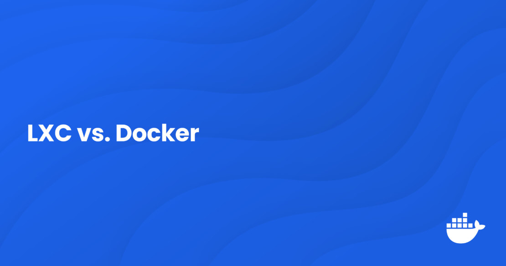
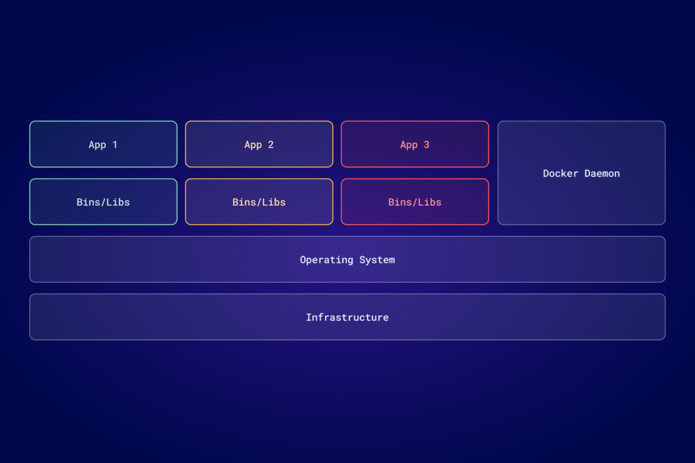

# LXC vs. Docker: Which One Should You Use?

By [Jason Perlow](https://www.docker.com/author/jason-perlow/) - Posted Jun 13, 2024

In today's evolving software development landscape, [containerization technology](https://www.docker.com/resources/what-container/) has emerged as a key tool for developers aiming to enhance efficiency and ensure consistency across environments. Among the various container technologies available today, Linux Containers (LXC) and Docker are two of the most popular choices. Understanding the differences between these technologies is crucial for developers to select the right tool that aligns with their specific project needs.

This blog post delves into the LXC vs. Docker virtual environments, exploring their functionalities and helping you make an informed decision.

## What is LXC?

[Linux Containers](https://linuxcontainers.org/lxc/introduction/), or LXC, is an advanced virtualization technology that utilizes key features of the Linux kernel to create lightweight and efficient isolated environments for running multiple applications on a single host system. This technology uses Linux kernel features, such as cgroups (control groups) and namespaces, to manage system resources and provide process isolation.

LXC began as an open source project to provide a virtualization method that operates at the operating system level, using the Linux kernel's inherent capabilities. The project emerged in the late 2000s — with significant contributions from IBM, among others — and quickly became part of the mainstream Linux kernel. This integration allowed LXC to benefit from native support and optimizations, facilitating its adoption and ongoing development.

LXC has played a pivotal role in the evolution of container technologies. It laid the groundwork for future innovations in containerization, including the development of Docker, which initially relied on LXC as its default execution environment before transitioning to its own container runtime,`libcontainer`(now part of `runc`).

### Key features of LXC

- **Resource management with cgroups:** LXC manages resource allocation using cgroups, ensuring that each container has access to the resources it needs without impacting others, promoting efficient and stable performance.
- **Isolation with namespaces:** Namespaces ensure that containers are kept isolated from each other, preventing processes in one container from interfering with those in another. This feature enhances security and system reliability.

### Benefits of LXC

- **Lightweight nature:** Unlike traditional virtual machines that require separate operating system (OS) instances, LXC containers share the host system's kernel, making them more resource-efficient and faster to start.
- **Proximity to the operating system:** Thanks to its integration with the Linux kernel, LXC provides functionality similar to that of virtual machines but with a fraction of the resource demand.
- **Efficient use of system resources:** LXC maximizes resource utilization and scalability by enabling multiple containers to run on a single host without the overhead of multiple OS instances.

LXC is especially beneficial for users who need granular control over their environments and applications that require near-native performance. As an open source project, LXC continues to evolve, shaped by a community of developers committed to enhancing its capabilities and integration with the Linux kernel. LXC remains a powerful tool for developers looking for efficient, scalable, and secure containerization solutions.

## What are Docker containers?

[Docker](https://www.docker.com/) offers a comprehensive platform and suite of tools that has revolutionized how applications are developed, shipped, and run. It is built upon the concept of containerization, simplifying it to such an extent that it has become synonymous with containers.

Docker, which launched in 2013, initially utilized LXC to provide an easier way to create, deploy, and run applications using containers. Docker's introduction marked a significant shift in virtualization technology, offering a lighter, faster, and more agile way of handling applications than traditional virtual machines. Docker quickly evolved from using LXC as its default execution environment by developing its own container runtime, libcontainer, which now powers Docker containers.

This move enabled Docker to provide a standardized unit of software deployment, encapsulating applications and their dependencies in containers that could run anywhere, from a developer's local laptop to a production server in the cloud.

### Docker's ecosystem

|                                                                                                                       |                                                                                                                                                      |                                                                                                                                       |                                                                                                                                                                                      |                                                                                                              |
| --------------------------------------------------------------------------------------------------------------------- | ---------------------------------------------------------------------------------------------------------------------------------------------------- | ------------------------------------------------------------------------------------------------------------------------------------- | ------------------------------------------------------------------------------------------------------------------------------------------------------------------------------------ | ------------------------------------------------------------------------------------------------------------ |
| [**Docker Desktop**](https://www.docker.com/products/docker-desktop/)                                                 | [**Docker Engine**](https://docs.docker.com/engine/)                                                                                                 | [**Docker Scout**](https://www.docker.com/products/docker-scout/)                                                                     | [**Docker Hub**](https://www.docker.com/products/docker-hub/)                                                                                                                        | [**Docker Build Cloud**](https://www.docker.com/products/build-cloud/)                                       |
| Known for its user-friendly interface, Docker Desktop simplifies tasks in building, running, and managing containers. | The core runtime component of Docker shipped in Docker Desktop provides a lightweight and secure environment for running containerized applications. | Docker Scout delivers near real-time actionable insights, making it simple to secure and manage the software supply chain end-to-end. | The world's largest and most widely used image repository, Docker Hub serves as the go-to container registry for developers to share and manage containerized applications securely. | Docker Build Cloud is a premium service that enhances the image-building process in enterprise environments. |

These tools collectively form a solution stack that addresses the entire lifecycle of container management, from development to deployment.

### How Docker enhances LXC

Although Docker started with LXC, it added significant value by layering tools and services that enhance user experience and management capabilities. Docker Desktop abstracts much of the complexity of managing containers through user-friendly interfaces and commands, making containerization accessible to a broader range of developers.

[Docker containers](https://docs.docker.com/guides/docker-concepts/the-basics/what-is-a-container/) are lightweight, portable, and self-sufficient units that contain everything needed to run an application. They ensure consistency across multiple development and deployment environments.

### Key benefits of Docker containers

- **Portability:** Containers can be moved effortlessly between environments, from development to testing to production, without needing changes, thanks to Docker's ability to ensure consistency across platforms.
- **Ease of use:** Docker simplifies container management with intuitive commands like `docker run`, significantly lowering the learning curve for new users.
- **Vast ecosystem:** Docker's extensive library of container images available on Docker Hub and a wide array of management tools support rapid application development and deployment.

The evolution of Docker from a product that simplified the use of LXC to a comprehensive ecosystem that defines modern containerization practices showcases its transformative impact on the technology landscape. Docker made containers mainstream and established a global community of developers and organizations that continue to innovate on its platform.

## Understanding use cases for LXC and Docker

Understanding their strengths and typical use cases is crucial when deciding between LXC and Docker. Both technologies serve the purpose of containerization but cater to different operational needs and user profiles.

### LXC use cases

- **Efficient access to hardware resources:** LXC's close interaction with the host OS allows it to achieve near-native performance, which is beneficial for applications that require intensive computational power or direct hardware access. This can include data-heavy applications in fields like data analysis or video processing where performance is critical.
- **Virtual Desktop Infrastructure (VDI):** LXC is well-suited for VDI setups because it can run full operating systems with a smaller footprint than traditional VMs. This makes LXC ideal for businesses deploying and managing virtual desktops efficiently.

LXC is not typically used for application development but for scenarios requiring full OS functionality or direct hardware integration. Its ability to provide isolated and secure environments with minimal overhead makes it suitable for infrastructure virtualization where traditional VMs might be too resource-intensive.

### Docker use cases

Docker excels in environments where deployment speed and configuration simplicity are paramount, making it an ideal choice for modern software development. Key use cases where Docker demonstrates its strengths include:

- **Streamlined deployment:** Docker packages applications into containers along with all their dependencies, ensuring consistent operation across any environment, from development through to production. This eliminates common deployment issues and enhances reliability.
- **Microservices architecture**: Docker supports the development, deployment, and scaling of microservices independently, enhancing application agility and system resilience. Its integration with Kubernetes further streamlines the orchestration of complex containerized applications, managing their deployment and scaling efficiently.
- **CI/CD pipelines:** Docker containers facilitate continuous integration and deployment, allowing developers to automate the testing and deployment processes. This approach reduces manual intervention and accelerates release cycles.
- **Extensive image repository and configuration management:** Docker Hub offers a vast repository of pre-configured Docker images, simplifying application setup. Docker's configuration management capabilities ensure consistent container setups, easing maintenance and updates.

Docker's utility in supporting rapid development cycles and complex architectures makes it a valuable tool for developers aiming to improve efficiency and operational consistency in their projects.

## Docker vs. LXC: Detailed comparison chart

|                             |                                                                                 |                                                                                                 |
| --------------------------- | ------------------------------------------------------------------------------- | ----------------------------------------------------------------------------------------------- |
| **Feature/Aspect**          | **Docker**                                                                      | **LXC**                                                                                         |
| **Core functionality**      | Application containerization; runs apps in isolated containers.                 | OS-level virtualization; runs multiple Linux systems on a host from a single OS.                |
| **User interface**          | High-level commands and graphical interface options for simpler management.     | Lower-level, command-line focused with finer granular control over settings.                    |
| **Ease of use**             | User-friendly for developers with minimal Linux/container knowledge.            | Requires more in-depth knowledge of Linux systems and configurations.                           |
| **Setup complexity**        | Simplified setup with pre-built packages and extensive documentation.           | More complex setup requiring detailed OS configuration knowledge.                               |
| **Performance**             | Lightweight, with minimal overhead; suitable for microservices.                 | Close to native performance, suitable for intensive computational tasks.                        |
| **Security**                | Strong isolation with Docker Engine, support for namespaces, and cgroups.       | Uses Linux kernel security features, including AppArmor and SELinux profiles.                   |
| **Scalability**             | Highly scalable, ideal for applications needing quick scaling.                  | Less scalable compared to Docker; best used for more static, controlled environments.           |
| **Application use cases**   | Ideal for CI/CD pipelines, microservices, and any container-based applications. | Best for running full Linux distributions, VDI, or applications needing direct hardware access. |
| **Resource efficiency**     | Highly efficient in resource usage due to shared OS components.                 | More resource-intensive than Docker but less so than traditional VMs.                           |
| **Community and ecosystem** | Large community with a vast ecosystem of tools and resources.                   | Smaller community focused mainly on system administrators and advanced users.                   |
| **Typical deployment**      | Common in development environments, cloud platforms, and serverless computing.  | Used in environments requiring stable, long-term deployments without frequent changes.          |

Although Docker and LXC are both powerful options for building containers, they serve different purposes and are suitable for different skill levels. Docker is designed for developers who want to quickly and efficiently build and deploy applications in various environments with minimal setup. On the other hand, LXC is more suitable for users who need a lightweight alternative to virtual machines and want more control over the operating system and hardware.

## Conclusion

Choosing between Linux Containers vs. Docker depends on your project's specific needs and operational environment.

- LXC is ideal for scenarios requiring full operating system functionality or extensive hardware interaction, making it suitable for projects needing deep system control or stable, long-term deployments.
- Docker is optimized for developers seeking to enhance application development and deployment efficiency, particularly in dynamic environments that demand rapid scaling and frequent updates.

Each platform offers unique benefits tailored to different technical requirements and use cases, ensuring the selection aligns with your project goals and infrastructure demands.

**Try Docker containers using [Docker Desktop](https://www.docker.com/products/docker-desktop/) today.**

## Learn more

- Get started by [exploring Docker containers](https://docs.docker.com/guides/walkthroughs/what-is-a-container/).
- Download the [latest version of Docker Desktop](https://docs.docker.com/get-docker/).
- Learn more about [Linux containers](https://linuxcontainers.org/).
- Visit Docker Resources to [explore more materials](https://www.docker.com/resources/).
- Subscribe to the [Docker newsletter](https://www.docker.com/newsletter-subscription/).
