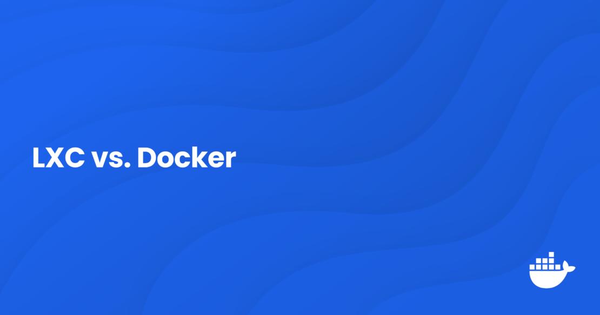
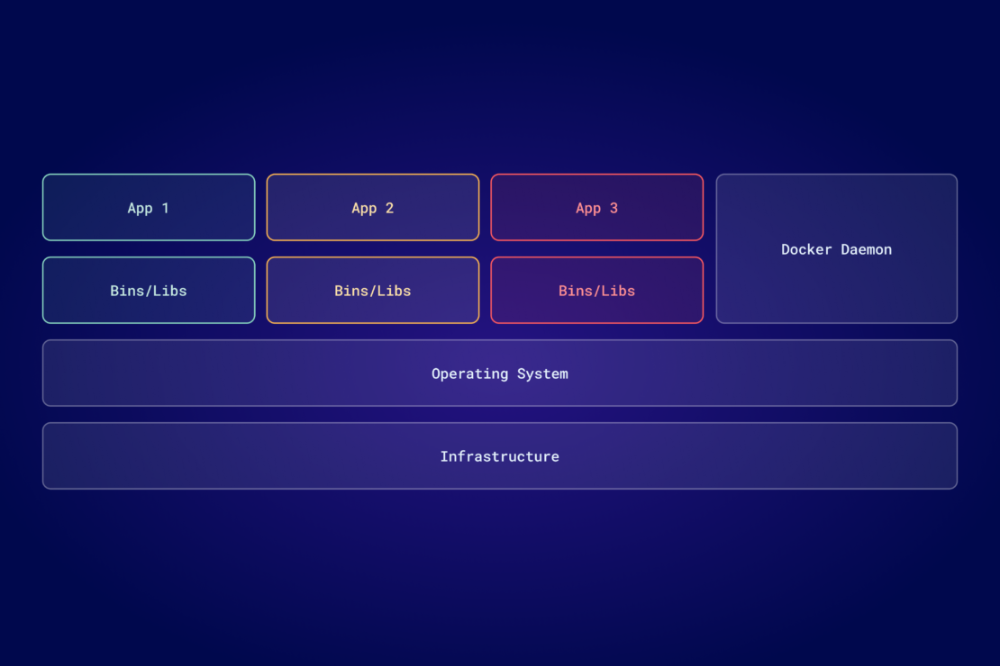
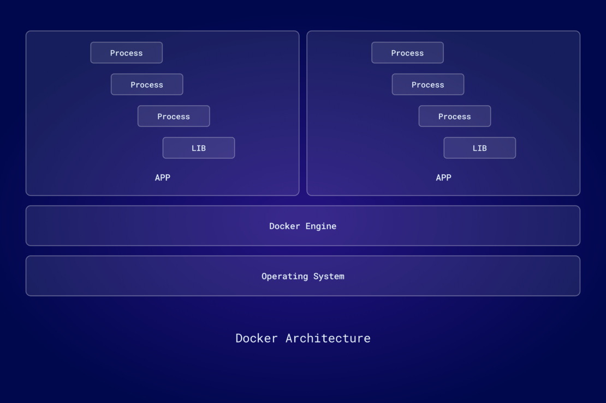

# LXC 与 Docker：你应该选择哪个？

作者：[Jason Perlow](https://www.docker.com/author/jason-perlow/) - 发布于 2024年6月13日

在当今不断演进的软件开发领域，**容器化技术** 已成为提高开发效率并保证环境一致性的关键工具。如今可用的多种容器技术中，**Linux 容器（LXC）** 与 **Docker** 是最受欢迎的两种选择。了解它们之间的差异，对于开发者选择最符合项目需求的工具非常重要。

本文将深入比较 LXC 与 Docker 的虚拟化环境，探讨各自的功能与适用场景，帮助你做出明智的选择。

## 什么是 LXC？

[Linux 容器](https://linuxcontainers.org/lxc/introduction/)，简称 LXC，是一种基于 Linux 内核关键特性的高级虚拟化技术，用于创建轻量且高效的隔离环境，在单一宿主机上运行多个应用。此技术利用了 Linux 内核的特性——例如 控制组（cgroups）和 命名空间（namespaces）——来管理系统资源并提供进程隔离。

LXC 最初作为一个开源项目出现，目的是提供一种在操作系统层面运行的虚拟化方法，依赖于 Linux 内核的原生能力。该项目在 2000 年代后期兴起，并得到包括 IBM 在内的多方贡献，随后被广泛纳入主流 Linux 内核。这种整合使 LXC 能够受益于内核级别的原生支持与优化，推动了其被采用和持续发展。

LXC 在容器技术的发展中发挥了重要作用。它为后续容器化创新奠定了基础，包括 Docker 的出现。Docker 最初将 LXC 作为默认执行环境，后来转向自有的容器运行时 `libcontainer`（现为 `runc` 的一部分）。

### LXC 的关键特性

- **借助 cgroups 的资源管理：** LXC 使用控制组来管理资源分配，确保每个容器在不影响其他容器的前提下获得所需资源，从而提升性能稳定性。
- **借助命名空间实现隔离：** 命名空间确保容器彼此隔离，防止一个容器中的进程干扰另一个容器，增强系统安全性与可靠性。

### LXC 的优点

- **轻量：** 与需要独立操作系统实例的传统虚拟机不同，LXC 容器共享宿主机的内核，因此更节省资源且启动更快。
- **接近操作系统层面：** 得益于与 Linux 内核的紧密整合，LXC 提供类似虚拟机的功能，但资源开销远小于虚拟机。
- **高效利用系统资源：** LXC 可以在单台主机上运行多个容器而不需要多个完整操作系统实例，从而提升可扩展性与资源利用率。

LXC 尤其适合需要对环境进行细粒度控制、或对性能接近原生有较高要求的应用场景。作为一个开源项目，LXC 在社区推动下持续演进，与 Linux 内核的整合也在不断加强，是寻求高效、可扩展且安全的容器化解决方案的开发者的重要工具。

## 什么是 Docker 容器？

[Docker](https://www.docker.com/) 提供了一整套平台与工具，彻底改变了应用的开发、打包与运行方式。它建立在容器化概念之上，并将该概念简化到便于开发者广泛使用的程度，使得“Docker”几乎成了容器的代名词。

Docker 于 2013 年推出，最初也是利用 LXC 来简化创建、部署与运行容器化应用的流程。Docker 的出现标志着虚拟化技术的一次重大转变，提供了一种比传统虚拟机更轻、更快且更灵活的应用运行方式。随后，Docker 从使用 LXC 逐步演进为采用自有运行时 libcontainer（现为 `runc` 的一部分），从而形成了更标准化的软件部署单元：包含应用及其依赖的容器，这些容器可以在从开发者本机到云端生产环境的任意地方运行。

### Docker 的生态系统

| 产品                                                                   | 说明                                                                                          |
| ---------------------------------------------------------------------- | --------------------------------------------------------------------------------------------- |
| [**Docker Desktop**](https://www.docker.com/products/docker-desktop/)  | 以用户友好的界面著称，简化了构建、运行与管理容器的操作。                                      |
| [**Docker Engine**](https://docs.docker.com/engine/)                   | Docker 的核心运行时组件（在 Docker Desktop 中也提供），为运行容器化应用提供轻量且安全的环境。 |
| [**Docker Scout**](https://www.docker.com/products/docker-scout/)      | 提供近实时的可操作洞察，便于端到端地管理和保障软件供应链的安全。                              |
| [**Docker Hub**](https://www.docker.com/products/docker-hub/)          | 世界上最大、使用最广泛的镜像仓库，开发者可在此共享和管理容器镜像。                            |
| [**Docker Build Cloud**](https://www.docker.com/products/build-cloud/) | 面向企业的高级镜像构建服务，增强镜像构建流程。                                                |

这些工具共同构成了一个完整的解决方案栈，覆盖从开发到部署的容器管理全生命周期。

### Docker 如何增强 LXC

虽然 Docker 起步时依赖 LXC，但它通过增加一层工具与服务极大提升了用户体验与管理能力。Docker Desktop 抽象了很多容器管理的复杂性，提供了更易用的界面和命令，使得容器化对更广泛的开发者群体可及。

[Docker 容器](https://docs.docker.com/guides/docker-concepts/the-basics/what-is-a-container/) 是轻量、可移植且自包含的软件单元，内含运行应用需要的一切，确保在不同开发与部署环境中具有一致性。

### Docker 容器的主要好处

- **可移植性：** 容器可以轻松在不同环境间迁移（从开发到测试再到生产），无需修改，Docker 保证了跨平台的一致性。
- **易用性：** Docker 用诸如 `docker run` 的直观命令简化了容器管理，大幅降低了学习门槛。
- **庞大生态：** Docker Hub 上丰富的镜像库与众多管理工具支持快速的应用开发与部署。

Docker 从简化 LXC 使用到构建一个定义现代容器化实践的综合生态系统，其影响力显著。Docker 使容器成为主流，并建立了一个全球性的开发者与组织社区，不断在该平台上创新。

## 理解 LXC 与 Docker 的使用场景

在决定使用 LXC 还是 Docker 时，理解各自的优势与典型适用场景至关重要。两者都属于容器化技术，但面向的运维需求与用户群体不同。

### LXC 的使用场景

- **高效的硬件资源访问：** LXC 与宿主操作系统的紧密结合使其能实现接近原生的性能，适用于需要大量计算或直接硬件访问的应用，例如数据分析或视频处理等对性能敏感的负载。
- **虚拟桌面基础架构（VDI）：** LXC 适合 VDI 场景，因为它可以在比传统虚拟机更小的开销下运行完整操作系统，这对于企业部署与管理虚拟桌面非常有利。

总体来说，LXC 通常不作为应用开发的首选工具，而更适合需要完整操作系统功能或直接硬件集成的场景。它在提供隔离且安全的环境同时，开销远小于传统虚拟机，非常适合需要基础设施虚拟化但不想承担 VM 重开销的场合。

### Docker 的使用场景

Docker 在需要快速部署与简单配置的场景中表现尤为出色，是现代软件开发的理想选择。Docker 的优势适用场景包括：

- **简化部署：** Docker 将应用及其依赖封装在容器内，保证在任何环境中都能一致运行，从开发到生产都减少了部署问题。
- **微服务架构：** Docker 支持独立开发、部署与扩展微服务，提升系统敏捷性与弹性。与 Kubernetes 的集成进一步简化了复杂容器化应用的编排与扩缩容管理。
- **CI/CD 管道：** Docker 容器便于自动化测试与部署，减少手动干预，加速发布周期。
- **丰富的镜像仓库与配置管理：** Docker Hub 提供大量预配置镜像，简化应用搭建；Docker 的配置管理能力也有助于确保容器环境一致性，便于维护与更新。

综上，Docker 对于追求快速迭代与复杂架构支持的开发团队，能显著提升效率与一致性。

## Docker 与 LXC：详细对比表

| 特性 / 方面         | **Docker**                                              | **LXC**                                                      |
| ------------------- | ------------------------------------------------------- | ------------------------------------------------------------ |
| **核心功能**        | 应用容器化；在隔离容器中运行应用。                      | 操作系统级虚拟化；在单一宿主 OS 上运行多个 Linux 系统。      |
| **用户界面**        | 提供高层命令和图形界面选项，便于管理。                  | 较低层次、以命令行为主，对设置有更细粒度的控制。             |
| **易用性**          | 对开发者友好，不要求太多 Linux/容器知识。               | 需要更深入的 Linux 系统与配置知识。                          |
| **安装/配置复杂度** | 简化的安装流程，提供预构建包和详尽文档。                | 配置较复杂，需要详细的操作系统配置知识。                     |
| **性能**            | 轻量，开销小；适合微服务。                              | 接近原生性能，适合计算密集型任务。                           |
| **安全性**          | 通过 Docker Engine 提供强隔离，支持命名空间与 cgroups。 | 使用 Linux 内核安全功能，包括 AppArmor 和 SELinux 配置文件。 |
| **可扩展性**        | 高度可扩展，适合需要快速扩缩容的应用。                  | 与 Docker 相比可扩展性较弱；更适合静态、可控的环境。         |
| **应用使用场景**    | 适合 CI/CD 管道、微服务和任何基于容器的应用。           | 适合运行完整 Linux 发行版、VDI 或需直接硬件访问的应用。      |
| **资源效率**        | 由于共享 OS 组件而非常节省资源。                        | 比 Docker 更耗资源，但仍低于传统虚拟机。                     |
| **社区与生态**      | 拥有庞大社区和丰富的工具生态。                          | 社区规模较小，主要面向系统管理员和高级用户。                 |
| **典型部署场景**    | 常见于开发环境、云平台和无服务器计算环境。              | 用于需要稳定、长期部署且不频繁变动的环境。                   |

尽管 Docker 与 LXC 都是构建容器的强大选项，但它们适合不同的目的和不同技能水平的用户。Docker 面向希望快速构建与部署应用、并尽量减少设置工作的开发者；而 LXC 更适合需要轻量替代虚拟机、对操作系统与硬件控制有更高要求的用户。

## 结论

在 Linux 容器（LXC）与 Docker 之间做选择，取决于你项目的具体需求与运行环境。

- **LXC**：适用于需要完整操作系统功能或大量硬件交互的场景，适合对系统有深度控制需求或追求稳定长期部署的项目。
- **Docker**：针对寻求提升应用开发与部署效率的开发者进行了优化，尤其适用于需要快速扩缩容与频繁更新的动态环境。

两者各有优劣，应根据技术需求与项目目标选择最合适的平台。

**立即使用 [Docker Desktop](https://www.docker.com/products/docker-desktop/) 体验 Docker 容器。**

## 了解更多

- 从 [探索 Docker 容器](https://docs.docker.com/guides/walkthroughs/what-is-a-container/) 开始。
- 下载 [最新版本的 Docker Desktop](https://docs.docker.com/get-docker/)。
- 了解更多关于 [Linux 容器](https://linuxcontainers.org/) 的信息。
- 访问 Docker 资源页以 [探索更多材料](https://www.docker.com/resources/)。
- 订阅 [Docker 通讯](https://www.docker.com/newsletter-subscription/)。
