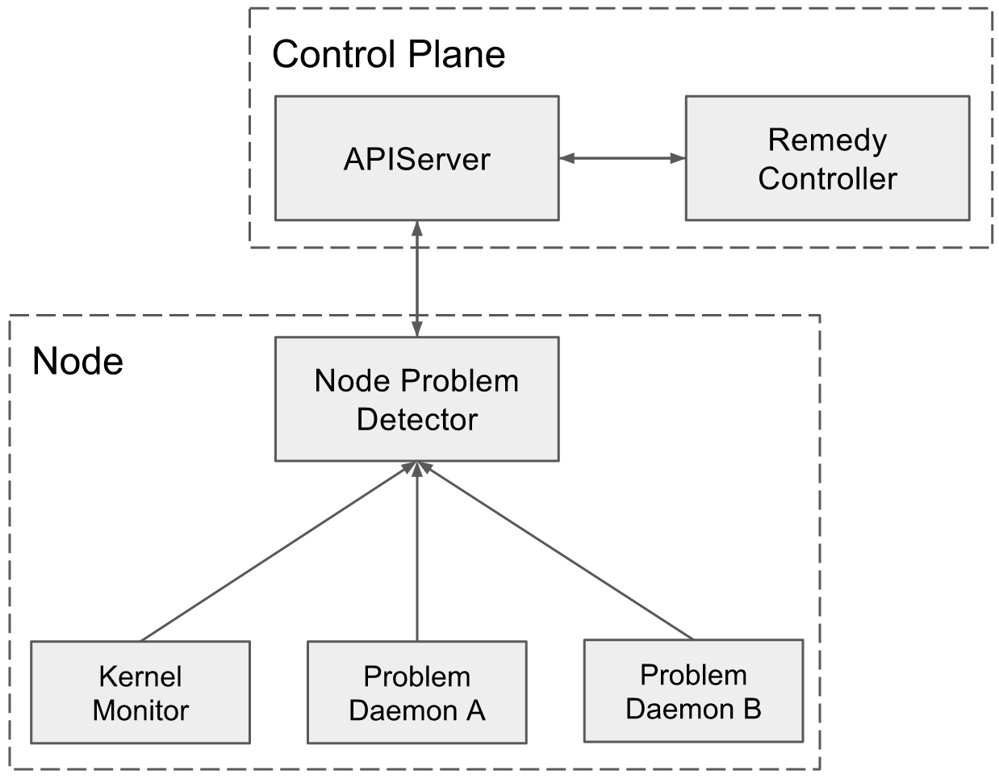

# **Node Problem Detector**

*Status: Draft*  
*Authors: lantaol@google.com*  
*Last Updated: 2016-06-06*

- [Objective](#objective)
- [Background](#background)
  - [Motivation](#motivation)
  - [Requirements](#requirements)
- [Overview](#overview)
  - [Key Concepts](#key-concepts)
  - [v0 (Kubernetes v1.3)](#v0-kubernetes-v13)
  - [Future (Kubernetes v1.4 and beyond)](#future-kubernetes-v14-and-beyond)
  - [OutOfScope](#outofscope)
  - [System Diagram](#system-diagram)
- [Detailed Design](#detailed-design)
  - [API](#api)
    - [Problem Type](#problem-type)
    - [NodeCondition](#nodecondition)
    - [Event](#event)
  - [Architecture](#architecture)
    - [Proposals](#proposals)
  - [Deployment](#deployment)
    - [Proposals](#proposals-1)
  - [Report Pipeline](#report-pipeline)
    - [Problem Daemon \-\> NodeProblemDetector](#problem-daemon---nodeproblemdetector)
    - [NodeProblemDetector \-\> APIServer](#nodeproblemdetector---apiserver)
  - [Problem Report Interface](#problem-report-interface)
  - [LogMonitor](#logmonitor)
- [Project Information](#project-information)

# Objective

NodeProblemDetector aims to make node problems visible to the control-plane. NodeProblemDetector will collect problems from various node problem daemons and report them to the control-plane. NodeProblemDetector will be easy to integrate with third-party node problem daemon.

# Background

## Motivation

There are tons of problems could happen on a node such as hardware problems like bad cpu, memory and disk; kernel problems like kernel deadlock and corrupted file system; container runtime problems like unresponsive runtime daemon etc. Many of them could make the node unavailable for pods.  
Currently these problems are invisible to Kubernetes. Even when there are critical node problems, Kubernetes will continue scheduling pods to the bad nodes. This has caused a lot of issues: [\#19986](https://github.com/kubernetes/kubernetes/issues/19986#issuecomment-174141729), [\#20096](https://github.com/kubernetes/kubernetes/issues/20096), [\#23327](https://github.com/kubernetes/kubernetes/issues/23327), [\#24295](https://github.com/kubernetes/kubernetes/issues/24295) etc.  
As a first step of solving this problem, we need to detect node problems and make them visible to the control-plane. Once the control-plane has the visibility to those problems, we can discuss the remedy system.  
The existing node daemons of Kubernetes are focusing on different aspects, but none of them have been or should be able to handle node problem detection:

* Kubelet: Kubelet is the primary “node agent” on each node. It is mainly responsible for pod lifecycle management.  
* Kube-proxy: Kube-proxy is network proxy on each node. It is mainly responsible for service network configuration.  
* cAdvisor: cAdvisor is responsible for container resource monitoring.

Therefore we need to introduce a new node daemon which is focusing on node health monitoring and node problem detection \- *NodeProblemDetector*.

## Requirements

As an open source container orchestration platform, people may run Kubernetes in heterogeneous environment.

* **Extensibility:** People may run Kubernetes on bare metal or VMs, with different hardware, different os distros, different init systems, different container runtimes, etc. It is impossible for a single daemon to handle all these scenarios. So *extensibility* becomes the top requirement for NodeProblemDetector. It must be easy to integrate with different problem daemons so that people can run it with a combination of daemons dedicated to their environment.  
* **Stability:** The problem detector itself should be stable and try best to survive from node problems.  
* **Scalability:** NodeProblemDetector will run on every node. It should put minimum pressure on apiserver and use minimum compute resource on the node.  
* **Security:** Node problems will be shown to users and may change system behaviour like scheduling decision in the future. It should be guaranteed that only qualified daemon could report node problems.   
* **Manageability:** Even in the same cluster, the cluster could be hybrid and the nodes could be heterogeneous. People may want to run special health monitor on master node, GPU health monitor on GPU nodes, windows health monitor on Windows nodes etc. So it should be possible for users to deploy different problem daemons on different nodes.

# Overview

## Key Concepts

* **Node Problem:** Node problems is the problem occurs to the node that may affect Kubernetes stability, includes:  
  * Hardware problem. (Bad cpu, bad memory, bad disk, bad gpu etc.)  
  * Kernel problem. (Kernel deadlock, corrupted file systems etc.)  
  * Runtime issue. (Unresponsive docker daemon, zombie docker daemon etc.)  
  * Other problems. (Other problems need attention in the future)  
* **Problem Daemon:** Problem daemon monitors a specific kind of node problems, such as disk problem monitor, kernel problem monitor, runtime problem monitor etc. The problem daemon:  
  * could be tools dedicated for Kubernetes’ use case.  
  * could also be an existing node health monitoring solution.

## v0 (Kubernetes v1.3)

* API: NodeProblemDetector will use NodeCondition and Event to report node problems to apiserver. A transient problem will be reported as an Event, and a permanent problem as a NodeCondition.  
* Pipeline:   
  * Each problem daemon will be a separate goroutine in NodeProblemDetector, and report problems to NodeProblemDetector via channel.  
  * NodeProblemDetector will consolidate events and conditions from different problem daemons and synchronize with apiserver.  
* Deployment: NodeProblemDetector and problem daemons will be shipped in a single binary. It will be an [add-on](https://github.com/kubernetes/kubernetes/tree/master/cluster/addons) [DaemonSet](http://kubernetes.io/docs/admin/daemons/) running on each node.  
* KernelMonitor: Introduce KernelMonitor as the first problem daemon for both Kubernetes’ urgent requirement and demonstration purpose. KernelMonitor will be monitoring kernel log and report kernel problems according to predefined rules.

## Future (Kubernetes v1.4 and beyond)

* Pipeline: Expose problem report interface from NodeProblemDetector, so that other problem daemons could integrate with it. After this, work with the community partners to integrate their problem daemons with Kubernetes.  
* Deployment: Run different problem daemons as separate containers in the NodeProblemDetector DaemonSet.  
* LogMonitor: Generalize the KernelMonitor to be a general purpose log monitor, and use it to detect some simple but critical Docker issues.  
* ControlPlane: Introduce RemedyController to the ecosystem to convert problem related Events and NodeConditions into [Taint](https://github.com/kubernetes/kubernetes/blob/master/docs/design/taint-toleration-dedicated.md), so as to inform scheduler to stop scheduling new pods to bad node and reschedule existing pods to other nodes. 

## OutOfScope

* NodeProblemDetector only makes it possible to integrate node problem daemons with Kubernetes. The responsibility of problem detection should be taken by specific node problem daemons.  
* Different node problem daemons remain owned by their respective vendors, Kubernetes node team will consult and support integrating the node problem daemons with NodeProblemDetector.   
* KernelMonitor (LogMonitor in the future) only aims to detect known kernel and docker issues which have been proved to be critical to Kubernetes. It won’t become a general purpose kernel or docker problem detector.

## System Diagram



# Detailed Design

## API

Today, we’ve already used Event and NodeCondition to report some node problems such as OutOfDisk ([\#4135](https://github.com/kubernetes/kubernetes/issues/4135)), MemoryPressure ([\#21274](https://github.com/kubernetes/kubernetes/pull/21274)), NetworkUnavailable ([\#26415](https://github.com/kubernetes/kubernetes/pull/26415)). And we’ll also introduce a Taint API object ([\#18263](https://github.com/kubernetes/kubernetes/pull/18263)) indicating whether the node is schedulable. They are sufficient for the current use case. Other than introducing new API objects blindly, we’d prefer to consolidate the existing objects instead.  
Therefore NodeProblemDetector will use Event and NodeCondition to report node problems to apiserver.

### Problem Type

Based on the severity, node problems are currently divided into 2 categories:

* **Permanent:** Problems that impact long enough that the node is unavailable for hosting some kind of pods. NodeProblemDetector will report permanent problem as a NodeCondition.  
* **Temporary:** Problems that have limited impact on pod hosting, but are informative and useful. NodeProblemDetector will report temporary problem as an Event.

### NodeCondition

Following is the current [NodeCondition](https://github.com/kubernetes/kubernetes/blob/v1.3.0-alpha.4/pkg/api/types.go#L1894-L1901) api object:

```Go
type NodeCondition struct {
	Type               NodeConditionType
	Status             ConditionStatus
	LastHeartbeatTime  unversioned.Time
	LastTransitionTime unversioned.Time
	Reason             string
	Message            string
}
```

* Type: Type indicates the name of the bad node condition caused by the problem.  
  * Such as BadCPU, KernelDeadlock, RuntimeHung etc.  
  * *There should be a predefined list of NodeConditionTypes.* The list could be extended overtime but must be under control. Arbitrary string in Type field will make it hard for RemedyController to consume.  
* Reason: Reason is a brief string describing the problem.  
  * It is defined by problem daemons.  
  * It is meant for machine parsing and CLI display, so it should be well-formatted:   
    * CamelCase  
    * Length limit (?)  
    * Convention (?)  
* Message: Message is a string describing the detailed information of the problem.  
  * It is also defined by problem daemons.  
  * It could be an arbitrary string, but length limit (?) is needed in consideration of CLI display and apiserver storage.

Open issues: 

* Do we need problem source? How to expose that in the NodeCondition?  
  * Option 1: We could add source field in NodeCondition  
  * Option 2: We could add problem source as prefix of the Reason, but that would be less straightforward.  
* Should we remove NodeCondition when Status is false?  
  * No. Discussed in [\#25773](https://github.com/kubernetes/kubernetes/issues/25773)

### Event

Following is the current [Event](https://github.com/kubernetes/kubernetes/blob/v1.3.0-alpha.4/pkg/api/types.go#L2255-L2286) api object:

```Go
type Event struct {
	InvolvedObject ObjectReference
	Reason string
	Message string
	Source EventSource
	FirstTimestamp unversioned.Time
	LastTimestamp unversioned.Time
	Count int32
	Type string
}
```

* InvolvedObject: InvovledObject is set to Node ObjectReference.  
* Source: Name of the source problem daemon.  
* Reason & Message: The same with NodeCondition.  
* Type: Type is severity of the problem. Now there are only *Normal* and *Warning*, at least we should add *Error (?)*.

## Architecture

### Proposals

**Alternative 1: NodeProblemDetector gathers problems from problem daemons and synchronizes with apiserver. *(current proposal)***  
NodeProblemDetector is the centralized daemon, gathers node problems from all problem daemons on the node, consolidates the information and synchronizes with apiserver.

* Pros:  
  * Better scalability.  
    * Only NodeProblemDetector communicates with apiserver directly:  
      * Less connection.  
      * Centralized QPS control.  
    * NodeProblemDetector could gather and merge NodeConditions and update node status at once.  
      * Less QPS  
  * Better quality control. NodeProblemDetector could validate problem daemons and problems reported.  
* Cons:  
  * Complexity.  
    * Maintain api between NodeProblemDetector and problem daemons.   
    * Communication mechanism between NodeProblemDetector and problem daemons.

**Alternative 2: Different problem daemons directly talk with apiserver.**  
No centralized daemon needed, each problem daemon directly talks with apiserver.

* Pros:  
  * Simple. Let the problem daemons use api library directly.  
  * Extensible. Anyone could report problems by reporting Event and updating NodeConditions without touching any existing code.  
* Cons:  
  * Worse scalability.  
    * Many daemons watch and write the same Node object.  
    * Daemons control their own QPS.  
    * More QPS needed. Each daemon updates their own NodeCondition separately.  
  * Worse quality control.  
    * All problem detecting and reporting logics are in different problem daemons. Some of them are even not in our code base.  
    * Hard to control api library version used by different problem daemons.  
  * Worse debugability. Multiple daemon could update the same NodeStatus, it would be even harder to debug. ([related issue](https://github.com/kubernetes/node-problem-detector/issues/9))

## Deployment

Deployment indicates how NodeProblemDetector and problem daemons are deployed on the node. The following proposals assume NodeProblemDaemon running as the centralized daemon ([Architecture Alternative 1](#proposals))

### Proposals

**Alternative 1: Run NodeProblemDetector and problem daemons as different containers in the same pod. *(current proposal)***  
**Alternative 2: Run NodeProblemDetector as native process, problem daemons as pods.**

* Pros: (vs. Alternative 1\)  
  * No dependency on Docker daemon. If run NodeProblemDetector in a container, once docker daemon is restarted by supervisord because of node problem, NodeProblemDetector will also be restarted. There is a [chicken-egg issue](https://github.com/kubernetes/kubernetes/issues/26042#issuecomment-221739124). However, docker 1.12 will support [docker daemon hot upgrade](https://github.com/docker/docker/issues/2658), which could help.  
* Cons: (vs. Alternative 1\)  
  * Complexity:  
    * Bootstrap. Another native process to deploy on each node.  
    * Resource usage limit. [NodeAllocable](https://github.com/kubernetes/kubernetes/issues/13984).  
    * Security. Need to expose native process to problem daemon pods on the same node.

**Alternative 3: Run NodeProblemDetector as part of kubelet, problem daemons as pods.**

* Pros: (vs. Alternative 1\)  
  * Same with Alternative 2\.  
* Cons: (vs. Alternative 1\)  
  * Security. Need to expose kubelet to problem daemon pods on the same node.  
  * Unreliable: Kubelet takes more responsibility ≈ less reliability.

**Alternative 4: Run NodeProblemDetector and problem daemons in the same container.**

* Cons: (vs. Alternative 1\)  
  * Need process management in the container.  
  * Can not update separate problem daemons.  
  * Can not specify resource usage for different problem daemons.  
  * … Almost all cons for non-containerized application.

**Alternative 5: Run NodeProblemDetector and problem daemons as different pods.**

* Pros: (vs. Alternative 1\)  
  * Flexible deployment. Different problem daemons could be deployed separately. It’s easy to deploy specific problem daemon on specific kind of nodes.  
* Cons: (vs. Alternative 1\)  
  * Communication between pods on the same node is not as simple as that between containers in the same pod.  
  * Pod management overhead is higher than container management.  
  * Flexible deployment also means hard to deploy. NodeProblemDetector and different problem daemons are deployed separately.

## Report Pipeline

For [Architecture Alternative 1](#proposals), we need to design the report pipeline from problem daemons to NodeProblemDetector and then to apiserver.

### Problem Daemon \-\> NodeProblemDetector

All the following proposals assume that NodeProblemDetector and problem daemons are running as different containers in the same pod ([Deployment Alternative 1](#proposals-1)). For other deployment approaches, these proposals are also applicable, but may be more complex.  
**Alternative 1: Problem daemon pushes problem to NodeProblemDetector.**  
Define problem reporting interface. NodeProblemDetector exposes problem reporting interface from the endpoint, and problem daemons push problems to the endpoint.

* Pros:  
  * Extensibility. Any daemon implement the interface could integrate without changing NodeProblemDetector.  
* Cons:  
  * Complexity: Need flow control to avoid NodeProblemDetector being flooded or consuming too much resource.  
* **Option 1: Volume based endpoint.**  
  * Specify a volume as the endpoint. Each problem daemon writes problems to the volume. NodeProblemDetector monitors the volume to retrieve problems.  
* **Option 2: Network based endpoint. *(current proposal)***  
  * NodeProblemDetector exposes known network endpoint. Problem daemons report problem to the endpoint.

**Alternative 1.2: NodeProblemDetector pulls problems from Problem daemon.**  
Define problem fetching interface. Each problem daemon exposes problem fetching interface from endpoint, and NodeProblemDetector periodically pulls problems from problem daemons.

* Pros:  
  * NodeProblemDetector controls the poll interval.  
* Cons:  
  * Overhead: If NodeProblemDetector polls frequently, the overhead is higher.  
  * Latency: If NodeProblemDetector polls infrequently, the latency is higher.  
  * Complexity: NodeProblemDetector needs to be configured to know endpoints of all problem daemons.  
* **Option 1: Plugin in NodeProblemDetector.**  
  * NodeProblemDetector defines Go interface, implement different plugins to fetch and convert data from different problem daemons.  
  * Cons: Less extensible. Need to change and rebuild NodeProblemDetector image for each new problem daemon support.  
* **Option 2: Interface from problem daemon.**  
  * NodeProblemDetector defines RESTful interface, each problem daemon has a sidecar implementing the interface.

### NodeProblemDetector \-\> APIServer

NodeProblemDetector uses Kubernetes api client library to report events and node conditions.  
For events, it uses [event recorder](https://github.com/kubernetes/kubernetes/blob/master/pkg/client/record/event.go).  
For node conditions, it needs to update the node conditions once changed, and also needs to avoid the node conditions being modified by other components. There are 2 options:

* **Option 1: Watch+Patch.**  
  * [**The reason why Patch is necessary**](https://github.com/kubernetes/node-problem-detector/issues/9)**.**  
  * Pros: Watch can make sure that once the node conditions are modified, NodeProblemDetector will be informed, so that it could change the conditions back as soon as possible.  
  * Cons: NodeProblemDetector runs as daemon on every node, an extra Watch from every node is a relatively expensive.  
* **Option 2: Get+Patch. *(current proposal)***  
  * Pros: Periodically Get is much more lightweight than Watch.  
  * Cons: During the Get interval, the condition could still be changed for a long time.

Mostly different components should take in charge of different node conditions, a condition should seldom be written by multiple components, so Option 2 is a better choice.

## Problem Report Interface

Problem report interface is the interface between NodeProblemDetector and problem daemons. The following interface definition assumes problem daemons will push problem to NodeProblemDetector ([Report Pipeline Alternative 1](#problem-daemon--\>-nodeproblemdetector)).

```Go
// Severity is the severity of the problem event. Now we only have 2 severity 
// levels: Info and Warn, which are corresponding to the current kubernetes event
// types. We may want to add more severity levels in the future.
type Severity string

const (
	// Info is translated to a normal event.
	Info Severity = "info"
	// Warn is translated to a warning event.
	Warn Severity = "warn"
)

// Condition is the node condition used internally by problem detector.
type Condition struct {
	// Type is the condition type. It should describe the condition of node in
	// problem. For example KernelDeadlock, OutOfResource etc.
	Type string `json:"type"`
	// Status indicates whether the node is in the condition or not.
	Status bool `json:"status"`
	// Transition is the time when the node transits to this condition.
	Transition time.Time `json:"transition"`
	// Reason is a short reason of why node goes into this condition.
	Reason string `json:"reason"`
	// Message is a human readable message of why node goes into this condition.
	Message string `json:"message"`
}

// Event is the event used internally by node problem detector.
type Event struct {
	// Severity is the severity level of the event.
	Severity Severity `json:"severity"`
	// Timestamp is the time when the event is generated.
	Timestamp time.Time `json:"timestamp"`
	// Reason is a short reason of why the event is generated.
	Reason string `json:"reason"`
	// Message is a human readable message of why the event is generated.
	Message string `json:"message"`
}

// Status is the status problem daemons should report to node problem detector.
type Status struct {
	// Source is the name of the problem daemon.
	Source string `json:"source"`
	// Events are temporary node problem events. If the status is only a 		    
// condition update, this field could be nil. Notice that the events
	// should be sorted from oldest to newest.
	Events []Event `json:"events"`
	// Conditions are the permanent node conditions. The problem daemon
	// should always report the newest node conditions in this field.
	Conditions []Condition `json:"conditions"`
}
```

The server side implementation of the interface is simple. The client side needs a little more design:

* **Periodic Heartbeat.** Even though there is no node problem, the client should periodically report Status with the newest conditions to inform NodeProblemDetector of its aliveness.  
* **Rate Limit.** When there are problems, the client should accumulate events and conditions for a period of time and do batch report.  
* **Error Handling.** The client should handle update failure. When there is update failure, it should be configured to either discard or retry.

## LogMonitor

LogMonitor monitors and analyses specified log and report problems according to predefined rules. It is the first problem daemon introduced both for demonstration purpose and Kubernetes’ urgent requirement.  
Kubernetes is suffering from kernel deadlock and docker bug for a long time: [\#19986](https://github.com/kubernetes/kubernetes/issues/19986#issuecomment-174141729), [\#20096](https://github.com/kubernetes/kubernetes/issues/20096) etc. LogMonitor is designed to monitor logs such as kernel log and docker log, identify known issues and report them as node problems.  
Following is the brief architecture of LogMonitor:  


* **Log Monitor:** Log Monitor is the main loop. It gets logs from Log Watcher, stores them in Log Buffer, matches problem patterns in Log Buffer and reports problems if there is a match.  
* **Log Buffer:** Log Buffer buffers latest n lines of logs, and supports regex pattern matching in latest logs.  
* **Log Watcher:** Log Watcher watches specified log file. Once there is a new line, it will translate the log into the internal type and send it to Log Monitor.  
* **Translator:** Translator translates a log line into the internal type. *Translator is pluggable. To support new log format, only a new translator is needed.* The definition of the internal type is quite simple:

```Go
type Log struct {
	Timestamp int64 // microseconds since kernel boot
	Message   string
}
```

* **Rule:** Rule defines how Log Monitor should interpret the log. The definition of Rule:

```Go
// Type is the type of the problem.
type Type string

const (
	// Temp means the problem is temporary, only need to report an event.
	Temp Type = "temporary"
	// Perm means the problem is permanent, need to change the node condition.
	Perm Type = "permanent"
)

// Rule describes how log monitor should analyze the log.
type Rule struct {
	// Type is the type of matched problem.
	Type Type `json:"type"`
	// Condition is the type of the condition the problem triggered. Notice that
	// the Condition field should be set only when the problem is permanent, or 
	// else the field will be ignored.
	Condition string `json:"condition"`
	// Reason is the short reason of the problem.
	Reason string `json:"reason"`
	// Pattern is the regular expression to match the problem in the log. Notice
	// that the pattern must match to the end of the line.
	Pattern string `json:"pattern"`
}
```

By implementing different Translators and defining different rules, LogMonitor can support most kinds of logs and detect problems with stable patterns.

# Project Information

Project Location: [https://github.com/kubernetes/node-problem-detector](https://github.com/kubernetes/node-problem-detector)  
Team Mailing List: [kubernetes-node-team](https://groups.google.com/a/google.com/forum/#!forum/kubernetes-node)@

