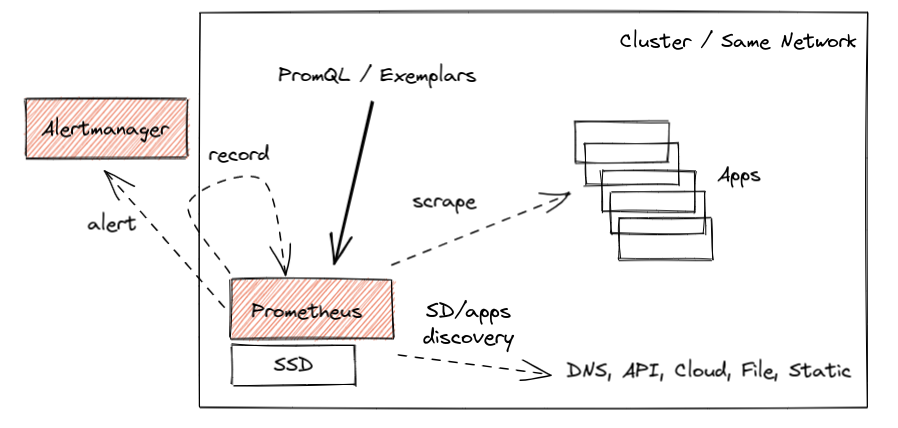
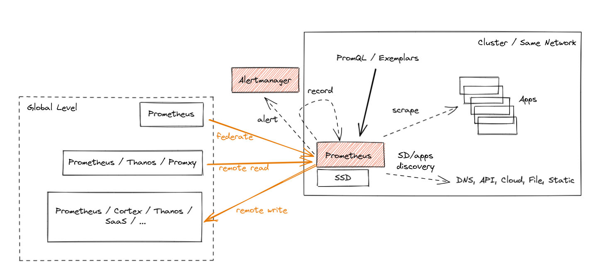
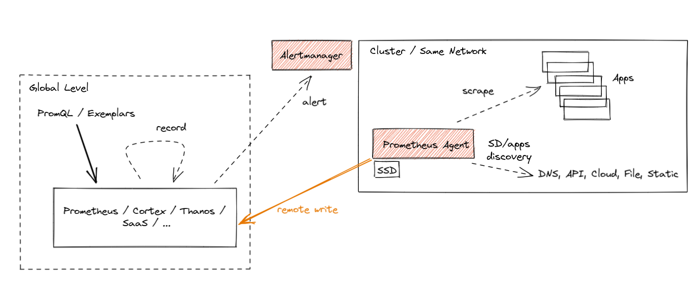

# 介绍 Prometheus Agent 模式：一种高效且云原生的指标转发方式

2021年11月16日 作者：Bartlomiej Plotka (@bwplotka)

> Bartek Płotka 自2019年起担任 Prometheus 维护者，是 Red Hat 的首席软件工程师。CNCF Thanos 项目的合著者。CNCF 大使和 CNCF TAG Observability 的技术负责人。在业余时间，他正在与 O'Reilly 合作撰写一本名为《Efficient Go》的书。观点仅代表个人意见！

我个人喜欢 Prometheus 项目的原因之一，也是我加入团队的重要原因之一，是该项目对目标的专注度。Prometheus 始终致力于在提供实用、可靠、廉价但极具价值的基于指标的监控方面突破界限。Prometheus 超稳定且强大的 API、查询语言和集成协议（例如 Remote Write 和 [OpenMetrics](https://openmetrics.io/)）使得云原生计算基金会（CNCF）的指标生态系统能够基于这些坚实的基础发展。由此产生了惊人的成果：

* 我们可以看到社区导出器几乎可以获取所有内容的指标，例如[容器](https://github.com/google/cadvisor)、[eBPF](https://github.com/cloudflare/ebpf_exporter)、[Minecraft 服务器统计](https://github.com/sladkoff/minecraft-prometheus-exporter)，甚至[园艺时的植物健康状况](https://megamorf.gitlab.io/2019/07/14/monitoring-plant-health-with-prometheus/)。
* 如今，大多数人期望云原生软件具有 Prometheus 可以抓取的 HTTP/HTTPS `/metrics` 端点。这个概念最初在 Google 内部秘密开发，并由 Prometheus 项目在全球范围内率先推广。
* 可观测性范式发生了转变。我们看到 SRE 和开发人员从一开始就严重依赖指标，这提高了软件的弹性、可调试性和数据驱动决策能力！

最终，我们几乎看不到没有运行 Prometheus 的 Kubernetes 集群。

Prometheus 社区的强大专注度也使得其他开源项目得以发展，将 Prometheus 部署模型扩展到单节点之外（例如 [Cortex](https://cortexmetrics.io/)、[Thanos](https://thanos.io/) 等）。更不用说云供应商采用 Prometheus 的 API 和数据模型（例如 [Amazon Managed Prometheus](https://aws.amazon.com/prometheus/)、[Google Cloud Managed Prometheus](https://cloud.google.com/stackdriver/docs/managed-prometheus)、[Grafana Cloud](https://grafana.com/products/cloud/) 等）。如果你在寻找 Prometheus 项目如此成功的单一原因，那就是：**将监控社区的注意力集中在重要的事情上**。

在这篇（篇幅较长的）博客文章中，我想介绍一种名为 "Agent" 的 Prometheus 运行新模式。它直接内置在 Prometheus 二进制文件中。Agent 模式禁用了 Prometheus 的一些常规功能，并优化了二进制文件以进行抓取和远程写入到远程位置。引入减少功能数量的模式使得新的使用模式成为可能。在这篇博客文章中，我将解释为什么这对 CNCF 生态系统中的某些部署来说是改变游戏规则的。我对此感到非常兴奋！

## 转发用例的历史

Prometheus 的核心设计在其整个生命周期中保持不变。受 [Google 的 Borgmon 监控系统](https://sre.google/sre-book/practical-alerting/#the-rise-of-borgmon) 的启发，你可以将 Prometheus 服务器部署在要监控的应用程序旁边，告诉 Prometheus 如何访问它们，并允许定期抓取其指标的当前值。这种通常被称为 "拉取模型" 的收集方法是 [使 Prometheus 轻量级且可靠](https://prometheus.io/blog/2016/07/23/pull-does-not-scale-or-does-it/) 的核心原则。此外，它使得应用程序检测和导出器变得非常简单，因为它们只需要提供一个简单的人类可读的 HTTP 端点，其中包含所有跟踪指标的当前值（以 OpenMetrics 格式）。所有这些都不需要复杂的推送基础设施和非平凡的客户端库。总体而言，简化的典型 Prometheus 监控部署如下所示：



这工作得很好，多年来我们已经看到了数百万个成功的部署，处理着数千万个活动序列。其中一些用于较长时间保留，比如两年左右。所有这些都允许查询、警报和记录对集群管理员和开发人员都有用的指标。

然而，云原生世界在不断发展。随着托管 Kubernetes 解决方案和在几秒钟内按需创建的集群的增长，我们现在终于能够将集群视为 "牛" 而不是 "宠物"（换句话说，我们对这些单个实例的关注较少）。在某些情况下，解决方案甚至不再具有集群概念，例如 [kcp](https://github.com/kcp-dev/kcp)、[Fargate](https://aws.amazon.com/fargate/) 和其他平台。


出现的另一个有趣用例是**边缘**集群或网络的概念。随着电信、汽车和物联网设备等行业采用云原生技术，我们看到越来越多资源受限的更小集群。这迫使所有数据（包括可观测性数据）传输到远程、更大的对应物，因为几乎没有任何数据可以存储在这些远程节点上。

这意味着什么？这意味着监控数据必须以某种方式聚合、呈现给用户，有时甚至存储在*全局*级别。这通常被称为**全局视图**功能。

天真地，我们可以考虑通过在全局级别放置 Prometheus 并跨远程网络抓取指标，或者直接从应用程序将指标推送到中心位置进行监控来实现这一点。让我解释为什么这两种方法通常都是*非常*糟糕的想法：

🔥 跨网络边界抓取如果给监控管道增加了新的未知因素，可能会带来挑战。本地拉取模型允许 Prometheus 确切知道指标目标何时出现问题以及为什么出现问题。也许它宕机了、配置错误、重新启动、提供指标太慢（例如 CPU 饱和）、服务发现无法发现、我们没有访问凭据，或者只是 DNS、网络或整个集群宕机。通过将我们的抓取器放在网络之外，我们可能会因为引入与单个目标无关的抓取不可靠性而丢失一些这些信息。最重要的是，如果网络暂时宕机，我们可能会完全失去重要的可见性。请不要这样做。这不值得。(:

🔥 直接从应用程序将指标推送到某个中心位置同样糟糕。特别是当你监控较大的机群时，如果你没有看到来自远程应用程序的指标，你几乎一无所知。是应用程序宕机了吗？是我的接收管道宕机了吗？也许应用程序授权失败？也许它无法获取我的远程集群的 IP 地址？也许它太慢了？也许网络宕机了？更糟糕的是，你可能甚至不知道来自某些应用程序目标的数据丢失了。而且你也没有获得太多好处，因为你需要跟踪应该发送数据的所有内容的状态和状态。这样的设计需要仔细分析，因为它很容易成为失败的配方。

> [!NOTE]
> 无服务器函数和短生命周期容器通常是我们考虑从应用程序推送作为解决方案的情况。然而，此时我们讨论的是事件或指标片段，我们可能希望将其聚合为更长生命周期的时间序列。这个主题在[这里](https://groups.google.com/g/prometheus-developers/c/FPe0LsTfo2E/m/yS7up2YzAwAJ)讨论，请随时贡献并帮助我们更好地支持这些情况！

Prometheus 引入了三种支持全局视图情况的方式，每种方式都有其优缺点。让我们简要介绍一下这些。它们在下面的图表中以橙色显示：



* **联邦**是第一个为聚合目的引入的功能。它允许全局级别的 Prometheus 服务器从叶子 Prometheus 抓取指标的子集。这种 "联邦" 抓取减少了跨网络的一些未知因素，因为联邦端点暴露的指标包括原始样本的时间戳。然而，它通常无法联邦所有指标，并且在较长的网络分区（几分钟）期间不会丢失数据。
* **Prometheus Remote Read** 允许从远程 Prometheus 服务器的数据库中选择原始指标，而无需直接进行 PromQL 查询。你可以在全局级别部署 Prometheus 或其他解决方案（例如 Thanos）来对这些数据执行 PromQL 查询，同时从多个远程位置获取所需的指标。这非常强大，因为它允许你 "本地" 存储数据，仅在需要时访问。不幸的是，也有缺点。没有像 [Query Pushdown](https://github.com/thanos-io/thanos/issues/305) 这样的功能，在极端情况下，我们需要拉取 GB 的压缩指标数据来回答单个查询。此外，如果我们有网络分区，我们暂时是盲目的。最后但并非最不重要的是，某些安全指南不允许入口流量，只允许出口流量。
* 最后，我们有 **Prometheus Remote Write**，这似乎是当今最受欢迎的选择。由于 Agent 模式专注于远程写入用例，让我们更详细地解释它。

### Remote Write

Prometheus Remote Write 协议允许我们将 Prometheus 收集的所有或部分指标转发（流式传输）到远程位置。你可以配置 Prometheus 将某些指标（如果你愿意，包括所有元数据和示例！）转发到一个或多个支持 Remote Write API 的位置。事实上，Prometheus 支持接收和发送 Remote Write，因此你可以在全局级别部署 Prometheus 来接收该流并聚合跨集群的数据。

虽然官方的 [Prometheus Remote Write API 规范处于审查阶段](https://docs.google.com/document/d/1LPhVRSFkGNSuU1fBd81ulhsCPR4hkSZyyBj1SZ8fWOM/edit)，但生态系统已将 Remote Write 协议作为默认的指标导出协议。例如，Cortex、Thanos、OpenTelemetry 以及云服务如 Amazon、Google、Grafana、Logz.io 等都支持通过 Remote Write 摄取数据。

Prometheus 项目还为其 API 提供官方合规性测试，例如 [remote-write sender compliance](https://github.com/prometheus/compliance/tree/main/remote_write_sender)，用于提供 Remote Write 客户端功能的解决方案。这是快速判断你是否正确实现此协议的绝佳方式。

从这样的抓取器流式传输数据通过允许你将指标数据存储在集中位置来实现全局视图用例。这也实现了关注点分离，当应用程序由与可观测性或监控管道不同的团队管理时，这很有用。此外，这也是为什么希望尽可能多地卸载客户工作的供应商选择 Remote Write 的原因。

> 等一下，Bartek。你刚才提到直接从应用程序推送指标不是最好的主意！

当然，但令人惊奇的是，即使使用 Remote Write，Prometheus 仍然使用拉取模型从应用程序收集指标，这使我们能够理解这些不同的故障模式。之后，我们批处理样本和序列，并将数据导出、复制（推送）到 Remote Write 端点，限制了中心点具有的监控未知数！

重要的是要注意，可靠且高效的远程写入实现是一个需要解决的非平凡问题。Prometheus 社区花了大约三年的时间才提出了一个稳定且可扩展的实现。我们多次重新实现了 WAL（预写日志），添加了内部队列、分片、智能退避等等。所有这些都对用户隐藏，用户可以享受性能良好的流式传输或存储在集中位置的大量指标。

### 动手 Remote Write 示例：Katacoda 教程

所有这些在 Prometheus 中都不是新功能。我们中的许多人已经使用 Prometheus 来抓取所有必需的指标，并将所有或部分指标远程写入到远程位置。

假设你想尝试 Remote Write 功能的动手体验。我们推荐 [Thanos Katacoda 教程，介绍从 Prometheus 远程写入指标](https://katacoda.com/thanos/courses/thanos/3-receiver)，它解释了 Prometheus 将所有指标转发到远程位置所需的所有步骤。它是**免费的**，只需注册一个帐户并享受教程！🤗

请注意，此示例使用接收模式下的 Thanos 作为远程存储。如今，你可以使用许多其他与远程写入 API 兼容的项目。

那么，如果远程写入工作正常，为什么我们还要在 Prometheus 中添加特殊的 Agent 模式呢？

## Prometheus Agent 模式

从 Prometheus `v2.32.0`（下一个版本）开始，每个人都将能够使用实验性的 `--enable-feature=agent` 标志运行 Prometheus 二进制文件。如果你想在发布前尝试它，请随意使用 [Prometheus v2.32.0-beta.0](https://github.com/prometheus/prometheus/releases/tag/v2.32.0-beta.0) 或使用我们的 `quay.io/prometheus/prometheus:v2.32.0-beta.0` 镜像。

Agent 模式优化了 Prometheus 用于远程写入用例。它禁用了查询、警报和本地存储，并用定制的 TSDB WAL 替换了它们。其他所有内容保持不变：抓取逻辑、服务发现和相关配置。如果你只想将数据转发到远程 Prometheus 服务器或任何其他 Remote-Write 兼容项目，它可以作为 Prometheus 的即插即用替代品。本质上，它看起来像这样：



Prometheus Agent 最棒的部分是它内置在 Prometheus 中。相同的抓取 API、相同的语义、相同的配置和发现机制。

如果你计划不在本地查询或警报数据并将指标流式传输到外部，使用 Agent 模式有什么好处？有几个：

首先，效率。我们定制的 Agent TSDB WAL 在成功写入后立即删除数据。如果无法访问远程端点，它会将数据临时持久化到磁盘，直到远程端点恢复在线。目前这仅限于两小时的缓冲区，类似于非 Agent Prometheus，[希望很快解除限制](https://github.com/prometheus/prometheus/issues/9607)。这意味着我们不需要在内存中构建数据块。我们不需要为查询目的维护完整的索引。本质上，Agent 模式在类似情况下使用的资源只是正常 Prometheus 服务器的一小部分。

这种效率重要吗？是的！正如我们提到的，对于某些部署来说，边缘集群上使用的每一 GB 内存和每一个 CPU 核心都很重要。另一方面，使用指标执行监控的范式如今已经相当成熟。这意味着对于相同的成本，你可以传输更多相关指标和更多基数 - 这更好。

> [!NOTE]
> 随着 Agent 模式的引入，原始的 Prometheus 服务器模式仍然作为推荐的、稳定的和维护的模式保留。带有远程存储的 Agent 模式带来了额外的复杂性。请谨慎使用。

其次，新 Agent 模式的好处是它使得摄入更容易水平扩展。这是我最兴奋的事情。让我解释一下原因。

### 梦想：自动可扩展的指标摄入

真正的自动可扩展抓取解决方案需要基于指标目标的数量和它们暴露的指标数量。我们需要抓取的数据越多，我们自动部署的 Prometheus 实例就越多。如果目标数量或其指标数量减少，我们可以缩减规模并删除一些实例。这将消除手动调整 Prometheus 大小的负担，并停止在集群暂时较小的情况下过度分配 Prometheus 的需求。

仅使用服务器模式的 Prometheus，这很难实现。这是因为服务器模式的 Prometheus 是有状态的。无论收集到什么都会原样保留在单个位置。这意味着缩减过程需要在终止之前将收集的数据备份到现有实例。然后我们会有重叠抓取、误导性陈旧标记等问题。

除此之外，我们需要一些能够聚合所有实例的所有样本的全局视图查询（例如 Thanos Query 或 Promxy）。最后但并非最不重要的是，服务器模式的 Prometheus 的资源使用取决于比摄入更多的事情。有警报、记录、查询、压缩、远程写入等，这些可能需要或多或少的资源，与指标目标的数量无关。

Agent 模式本质上将发现、抓取和远程写入移动到一个单独的微服务中。这允许专注于仅摄入的操作模型。因此，Agent 模式的 Prometheus 或多或少是无状态的。是的，为了避免指标丢失，我们需要部署一个 HA 对代理并将持久磁盘附加到它们。但从技术上讲，如果我们有数千个指标目标（例如容器），我们可以部署多个 Prometheus 代理并安全地更改哪个副本正在抓取哪些目标。这是因为最终所有样本都将被推送到相同的中心存储。

总体而言，Agent 模式的 Prometheus 实现了基于 Prometheus 的抓取的简单水平自动扩展能力，可以响应指标目标的动态变化。这绝对是我们将来与 [Prometheus Kubernetes Operator](https://github.com/prometheus-operator/prometheus-operator) 社区一起研究的事情。

现在让我们看看 Prometheus 中 Agent 模式的当前实现状态。它准备好使用了吗？

### Agent 模式已在规模上得到验证

Prometheus 的下一个版本将包括 Agent 模式作为实验性功能。标志、API 和磁盘上的 WAL 格式可能会更改。但实现的性能已经经过实战测试，这要归功于 [Grafana Labs'](https://grafana.com/) 开源工作。

我们 Agent 自定义 WAL 的初始实现受到当前 Prometheus 服务器 TSDB WAL 的启发，由 [Robert Fratto](https://github.com/rfratto) 在 2019 年创建，在 Prometheus 维护者 [Tom Wilkie](https://twitter.com/tom_wilkie) 的指导下进行。然后它被用于开源 [Grafana Agent](https://github.com/grafana/agent) 项目中，该项目自那时起被许多 Grafana Cloud 客户和社区成员使用。鉴于解决方案的成熟度，是时候将实现捐赠给 Prometheus 进行原生集成和更大规模的采用了。Robert（Grafana Labs）在 Srikrishna（Red Hat）和社区的帮助下，将代码移植到 Prometheus 代码库，两周前合并到了 `main`！

捐赠过程相当顺利。由于一些 Prometheus 维护者之前在 Grafana Agent 中为这段代码做出了贡献，并且由于新的 WAL 受到 Prometheus 自身 WAL 的启发，当前的 Prometheus TSDB 维护者不难完全接管它的维护！Robert 作为 TSDB 维护者加入 Prometheus 团队也真的很有帮助（恭喜！）。

现在，让我们解释一下如何使用它！(:

### 详细说明如何使用 Agent 模式

从现在开始，如果你显示 Prometheus 的帮助输出（`--help` 标志），你应该或多或少看到以下内容：

```
usage: prometheus [<flags>]

The Prometheus monitoring server

Flags:
  -h, --help                     Show context-sensitive help (also try --help-long and --help-man).
      (... other flags)
      --storage.tsdb.path="data/"
                                 Base path for metrics storage. Use with server mode only.
      --storage.agent.path="data-agent/"
                                 Base path for metrics storage. Use with agent mode only.
      (... other flags)
      --enable-feature= ...      Comma separated feature names to enable. Valid options: agent, exemplar-storage, expand-external-labels, memory-snapshot-on-shutdown, promql-at-modifier, promql-negative-offset, remote-write-receiver,
                                 extra-scrape-metrics, new-service-discovery-manager. See https://prometheus.io/docs/prometheus/latest/feature_flags/ for more details.
```

由于 Agent 模式位于功能标志后面，如前所述，使用 `--enable-feature=agent` 标志以 Agent 模式运行 Prometheus。现在，其余标志要么适用于服务器和 Agent，要么仅适用于特定模式。你可以通过检查标志帮助字符串的最后一句话来查看哪个标志适用于哪个模式。"Use with server mode only" 表示它仅适用于服务器模式。如果你没有看到这样的提及，则表示该标志是共享的。

Agent 模式接受相同的抓取配置，具有相同的发现选项和远程写入选项。

它还暴露了一个 Web UI，禁用了查询功能，但显示构建信息、配置、目标和服务发现信息，就像正常的 Prometheus 服务器一样。

### 动手 Prometheus Agent 示例：Katacoda 教程

与 Prometheus 远程写入教程类似，如果你想尝试 Prometheus Agent 功能的动手体验，我们推荐 [Thanos Katacoda 教程，介绍 Prometheus Agent](https://katacoda.com/thanos/courses/thanos/4-receiver-agent)，它解释了运行 Prometheus Agent 是多么容易。

## 总结

我希望你觉得这很有趣！在这篇文章中，我们介绍了出现的新情况，例如：

* 边缘集群
* 受限访问网络
* 大量集群
* 短暂和动态集群

然后我们解释了新的 Prometheus Agent 模式，它允许有效地将抓取的指标转发到远程写入端点。

与往常一样，如果你有任何问题或反馈，请随时 [在 GitHub 上提交工单或在邮件列表中提问](https://prometheus.io/community/)。

> 这篇博客文章是 CNCF、Grafana 和 Prometheus 之间协调发布的一部分。请随意阅读 [CNCF 公告](https://www.cncf.io/blog/) 和 [基于 Grafana Agent 的 Prometheus Agent 模式的角度](https://grafana.com/blog/2021/11/16/why-we-created-a-prometheus-agent-mode-from-the-grafana-agent)。

© Prometheus Authors 2014-2025 | 文档根据 CC-BY-4.0 分发

© 2025 The Linux Foundation. 保留所有权利。The Linux Foundation 拥有注册商标并使用商标。有关 The Linux Foundation 的商标列表，请参阅我们的 [商标使用](https://www.linuxfoundation.org/trademark-usage) 页面。